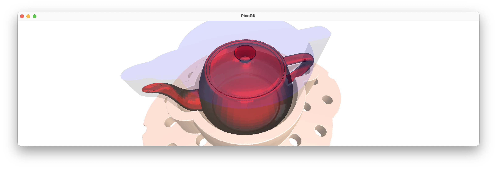
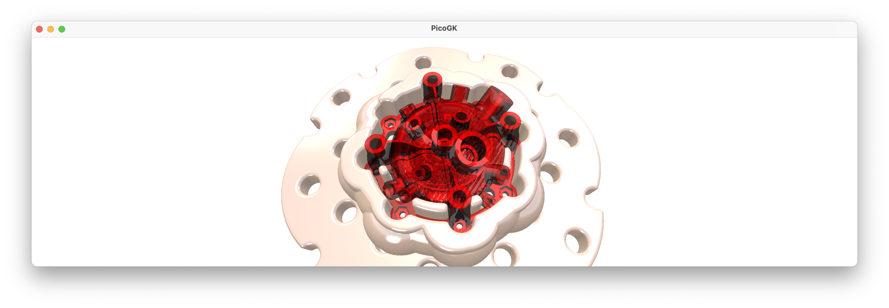
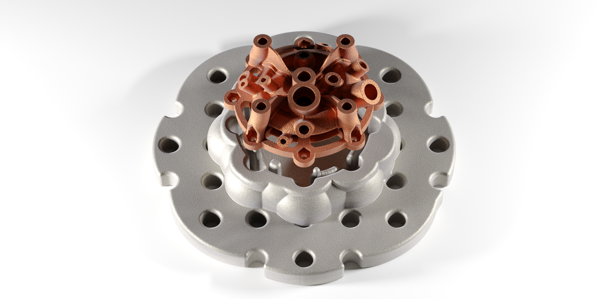

**[PicoGK.org](https://picogk.org)/coding for engineers**


**[Table of contents](TOC.md)**

# Let's build a computational fixture maker (Part 4)

Let's wrap up our fixture maker this week by looking at a feature I recently [introduced into PicoGK 1.7.5](https://github.com/leap71/PicoGK/releases/tag/PicoGK-v1.7.5).

When you work with `Voxels`, you constantly deal with boolean functions, Add, Subtract, Intersect.

So, when you add two `Voxels` objects together, you write:

```c#
Voxels vox1 = new(..);
Voxels vox2 = new(..);
vox1.BoolAdd(vox2);
```

And now `vox1` contains the contents of both voxel fields combined, in a way, it kind of contains the *sum* of both fields.

Logically, it doesn't seem that different to the way math works. Wouldn't it be nice to be essentially able to express voxel operations in a similar way you write math?

When I wrote PicoGK last year, I considered this, but ultimately decided against it. 

The problem with math notation is, that it can trick you into thinking that things function exactly like math works. In simple math `1+2-3` equals `1-3+2`. The order of operations doesn't matter. But in voxel operations the order matters very much. If you subtract at the end, you are cutting a hole into the voxels you previously combined. If you subtract in the second operation and add voxels later, you may be closing a hole you just cut in the first voxel field.

I concluded, it's not math, so it shouldn't look like it. So I implemented the functionality through regular methods (`Voxels.BoolAdd`, etc.) in the way you are used to by now.

## Using voxels like math

But this summer, I thought I should give it a try, and implemented *operator overloading* for the `Voxels` class.

It looks like this:

```c#
public static Voxels operator +(Voxels voxA, Voxels voxB)
{
    return voxA.voxBoolAdd(voxB);
}

public static Voxels operator -(Voxels voxA, Voxels voxB)
{
    return voxA.voxBoolSubtract(voxB);
}

public static Voxels operator &(Voxels voxA, Voxels voxB)
{
    return voxA.voxBoolIntersect(voxB);
}
```

These three very simple functions allow you to use the operators `+`, `-` and `&` for `Voxels` objects.

I first implemented these just as an experiment and then rewrote some code using the new notation. The result was such an advancement in the clarity of the code, that I decided to put it into the official PicoGK library.

Let's have a look how this new notation simplifies the code of our own little project here.

The first boolean operations can be found in the `voxCreateMountableFlange` method of the `BasePlate` class.

```c#
// Voxelize the lattice and drill the holes

Voxels voxDrills = new(latDrills);

Voxels voxDrilledFlange = new(voxFlange);
voxDrilledFlange.BoolSubtract(voxDrills);

// And we have a perforated flange
return voxDrilledFlange;
```

Let's start with the obvious target, the `BoolSubtract` function. It can now be written like this:

```c#
voxDrilledFlange = voxDrilledFlange - voxDrills;
```

Nice, but arguably not such a dramatic improvement. You could argue it's more or less the same as before.

But there's also the `-=` operator, we can use to shorten the notation. If you remember, `a -= b`, is shorthand for writing `a = a - b`. So this works here as well.

```c#
voxDrilledFlage -= voxDrills;
```

It shortens the code significantly — and it's still readable and intuitive.

But it gets better.

In our project we created a lot of local helper variables for the sole purpose of being able to use them as parameters to the various operations. First we create a `voxDrills` object. Then we create a copy of the `voxFlange` object, etc.

With the new method, we can write the following:

```c#
Voxels voxDrilledFlange = voxFlange - new Voxels(latDrills);
return voxDrilledFlange;
```

Or even shorter:

```c#
return voxFlange - new Voxels(latDrills);
```

That's quite intuitive isn't it?

Now, I could have implemented operators that also take a `Mesh` or `Lattice` as parameter. But voxelizing a `Mesh` or `Lattice` is potentially a time-consuming process, and I want us to be aware of that. If, for example, you had to use `latDrills` many times to cut things, it is important to actually store the result in a variable and not get too cavalier about automatic conversions.

Let's look at the rest of the code and see how it changes in the new notation. We have two `BoolIntersect` calls that we can replace by the *and* operator. The *and* operator is not as commonly recognizable at the `+` and `-`. It looks like this: `&`.

The `&` operator is used in boolean mathematics to indicate that the result should only contain the bits that are present in both operands. That is the same as our `BoolIntersect` call. It results in the `Voxels` that are present in both fields. So instead of

```c#
voxFlange.BoolIntersect(Voxels(Utils.mshCreateCube(oFlangeBounds));
```

we can write:

```c#
voxFlange &= new Voxels(Utils.mshCreateCube(oFlangeBounds));
```

These may seem like small changes. But when I applied them to larger projects, they were quite transformative.

Check out something like this:

```c#
Voxels voxResult = (voxUpper + voxBottom).voxOffset(fWallThickness)
                 + (voxPort - voxHole)
                 + voxInlet
                 + voxOutlet
                 + voxSupports;
```

Imagine how this would look like using the "old" notation. The new notation is short, but it's also clear what is happing.

Another example with the `&` operator (intersection) - note, again, the use of brackets to clarify the order of operations.

```c#
return (voxEngine + voxBasePlate) & voxPrinterVolume;
```

This adds the two voxel fields in the brackets first, and then intersects it with the printer bounds, resulting in only the voxels that fit into the printer.

Voxel math looks like real math now!

## Wrapping up the fixture app

Let's check out the remaining tasks that we had on our list, before we can call our fixture app a v1.0.

- There should be a small air gap between the fixture and the actual object, otherwise it will likely not fit properly
- We should eliminate small/tall features in the fixture, because they will cause issues during printing and handling, and are not really needed for the desired functionality

Let's start with the first one, a tolerance gap between object and fixture. First, we should probably not hard code the distance, as it depends on your printing process and maybe other things, like the object's surface roughness, overall manufacturing tolerances, etc.

In a future version of the app, we may want to query a 3D printer process database, or invoke functions of a class representing object's manufacturing process to calculate the correct tolerance number. But for now, we just extend our `Fixture.Object` class with another member (`m_fTolerance`) we can query. We add this as an optional parameter to the constructor, with a sensible default value:

```c#
public Object(  Mesh msh,
                float fObjectBottomMM,
                float fSleeveMM,
                float fWallMM,
                float fFlangeMM,
                float fObjectTolerance = 0.1f)
{
    ...
```

We add the default value to not break code that may already be using the object. 

That's good practice. If you add new functionality, always consider whether it needs to be a *breaking change*. If it is really crucial that all code using your class is updated — then by all means, change the fingerprint of your functionality in such a way, that existing code breaks and needs to be rewritten thoughtfully considering the changes you made.

But if the change you are introducing does *not* require the user of your code to make modifications, because, like in our case, you can default to behavior that is identical or similar to the existing one, you should avoid *breaking changes* and keep the class and function signature intact.

In our case, someone successfully using our `Fixture` class, will likely not object to the default parameter being what it is. So we want to keep the constructor signature the same, while giving advanced users access to the new functionality, by overriding the default value.

Always ask yourself — would a user of the new functionality be surprised by the change of behavior? If that's true, you may want to *intentionally* change the signature of the function, so people are forced to rewrite their code with the new behavior in mind.

In our case, the change is benign, so defaulting to a small tolerance, and leaving all code as is, is fine.

To make sure people use the parameter in the right way, we should check the range. In our case, it should definitely be larger or equal to `0`. So let's throw an `Exception` if not. If all fine, let's assign the value:

```c#
 if (fObjectTolerance < 0f)
    throw new Exception("Object tolerance must be equal or larger than 0");
 
m_fTolerance = fObjectTolerance;
```

OK, so much for that. How and where do we use it? In the fixture-making process, we are creating a voxel field `voxObjectRemovable` we use to cut the object away from the fixture:

```c#
// Let's make sure the object is removable
// by projecting the slices of the object upwards

Voxels voxObjectRemovable   = new(oObject.voxObject());
BBox3 oObjectBounds         = voxObjectRemovable.mshAsMesh().oBoundingBox();

voxObjectRemovable.ProjectZSlice(   oObjectBounds.vecMin.Z,
                                    oObjectBounds.vecMax.Z);

m_voxFixture -= voxObjectRemovable;
```

If we offset that object outwards by our tolerance value, we will create an indentation in our fixture, that is slightly larger than the object. That's what we want. 

It doesn't really matter where you do it in this process, as long as you do it before you subtract the object from your fixture.

Probably the best place is right after we make the copy:

```c#
Voxels voxObjectRemovable   = new(oObject.voxObject());
voxObjectRemovable.Offset(oObject.fObjectTolerance());
```

OK, mission accomplished for task number one. Let's look at it (I set the gap to 2mm, to make sure you can see it). You can see how there is now a small gap between the object and the fixture.



How do we deal with the second issue? Let's visualize the problem first.

It's hard to do with our standard teapot, so I used one of LEAP 71's rocket injector heads.


Generally, all looks good, but there is clearly an issue with these very small towering protrusions, which are caused by the screw holes of the injector's mounting flange. While we definitely want to use "pins in holes" to lock the object securely onto the flange, we really cannot deal with these very narrow, almost needle-like structures. Firstly, they are likely to fail during printing, secondly, they are borderline dangerous for the operator, and thirdly, they will likely break when you try place the object onto the fixture.

So, how can we get rid of small features in our computational approach to geometry?

Again, the offset functions are coming to the rescue. If you offset, say, a cube, inwards, and then offset it outwards again by the same distance, you have the same object, right?

But only of the object is not smaller than the offset distance.

To visualize: If you offset a 2mm wide cube inwards by 1mm on all sides, nothing is left. And then if you offset that voxel field containing "nothing" outwards by 1mm again, it doesn't change the fact, that there is nothing inside. So the small 2mm cube is gone for good.

But if you offset a cube of 3mm cube inwards by 1mm on all sides, you have a tiny 1mm cube afterwards. If you now offset it outwards by 1mm again, you are back to your 3mm wide cube, right? Now — this doesn't seem to make sense for regular objects like cubes. But for irregular objects, that contain fine features that are unwanted, you can use this approach to eliminate unwanted detail.

In our case, we want to eliminate features of a certain size, say 2mm. We can offset our entire fixture by -1mm and then again by +1mm — and all the features below that threshold are gone, while all features above that threshold look the same as before.

In other words, we can do:

```c#
m_voxFixture.Offset(-1);
m_voxFixture.Offset(+1);
```

To remove all features, which are less than 2mm in any dimension.

Since you do this a lot in voxel-based computational geometry, there is a handy helper function, called `OverOffset`.

So the two calls above can be done in one:

```c#
m_voxFixture.OverOffset(-1);
```

So let's try that and see if our fixture looks clean now.



That looks very nice, indeed. All small features, which may cause issues are gone, but the large features that are required to securely lock our object in place are still there. As a side effect, all sharp edges are smooth now, because they too represent a "small feature" that is affected by the offsetting. For our use case, it is a pretty good final result, that will do its work quite well as a fixture.



And with that, we have completed our first (quite simple) Computational Engineering Model (CEM): We went from abstract inputs (an existing object and a set of parameters) to a reasonably interesting result.

We automated an engineering process, creating a fixture, which is conventionally quite labor-intensive. There are, obviously, many improvements you could make this Computational Engineering Model. There's a lot to learn from engineers who have done this manually for a long time. Experienced "fixture masters" will look at the output and will find many things that that they would do differently. We have to listen and, over time, encode their learnings into a more robust model. And then listen again, and improve. Eventually you build something that can handle almost anything you throw at it. 

Iterative improvement is at the core of Computational Engineering. 

As usual, the [code for this chapter is on GitHub](https://github.com/LinKayser/Coding4Engineers).

------

Next: **Computational geometry (Part 1)**

[Jump into the discussion here](https://github.com/leap71/PicoGK/discussions/categories/coding-for-computational-engineers)

[Table of contents](TOC.md)

------

**[PicoGK.org](https://picogk.org)/coding for engineers**

© 2024 by [Lin Kayser](https://www.linkedin.com/in/linkayser/) — All rights reserved.