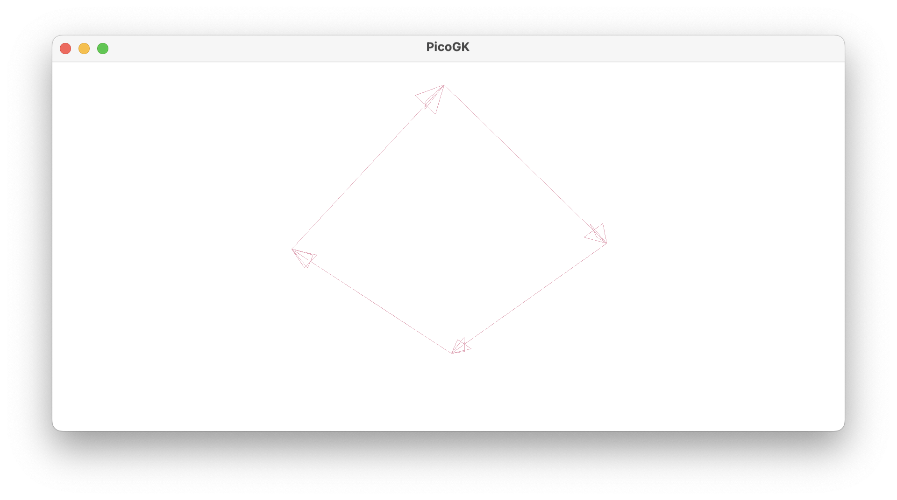
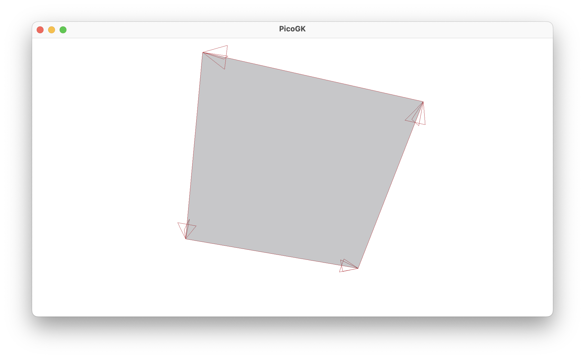
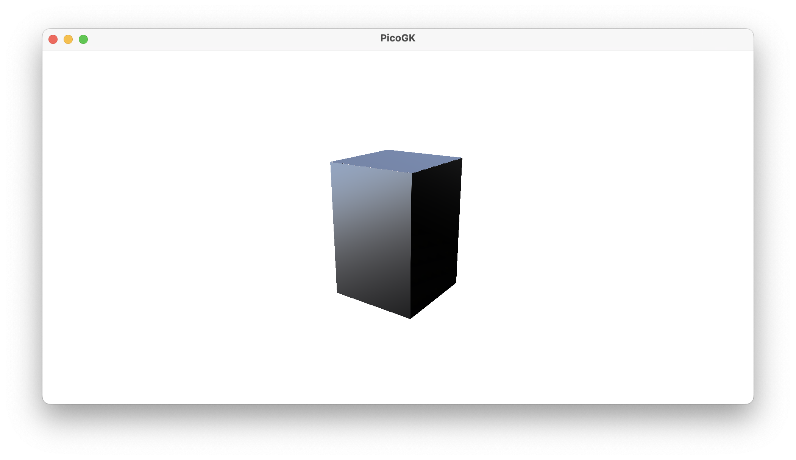
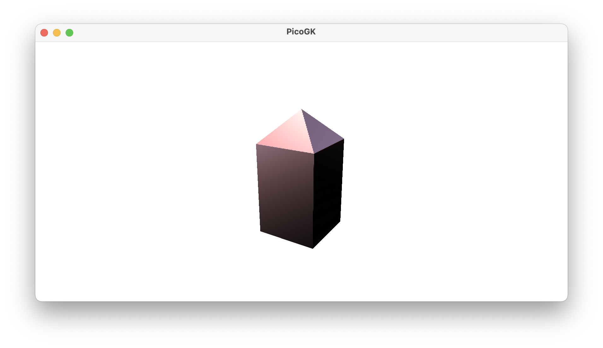
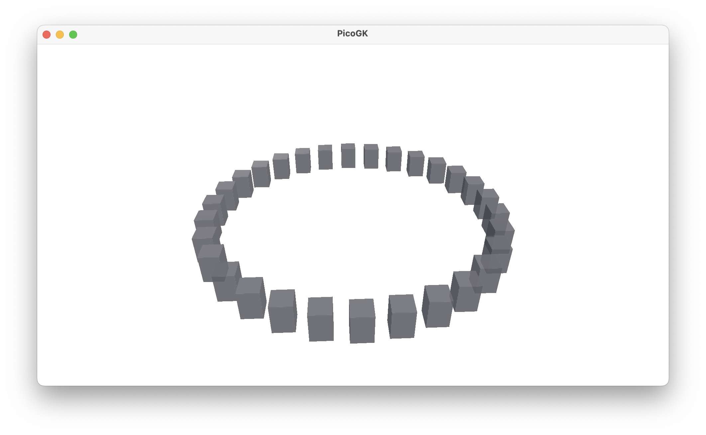
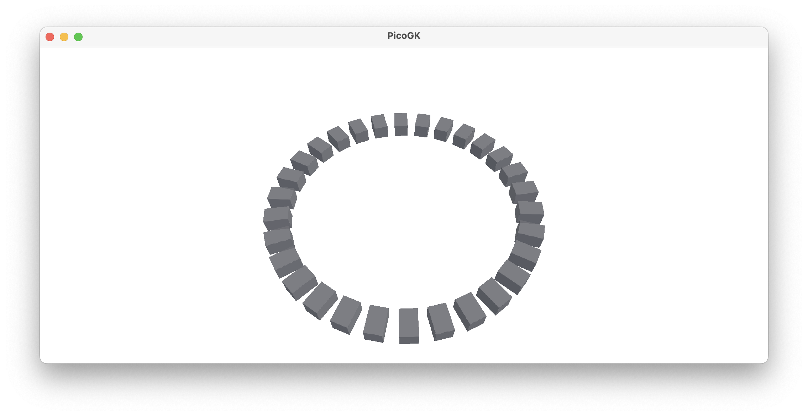
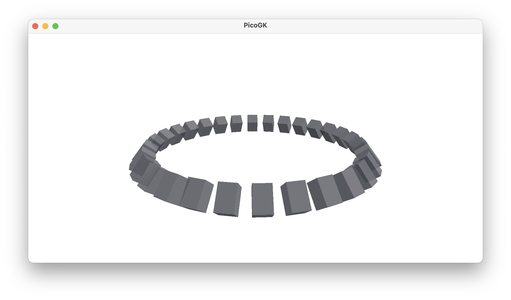

**[PicoGK.org](https://picogk.org)/coding for engineers**


**[Table of contents](TOC.md)**

# Computational geometry (Part 3)

Today we will talk about one of the oldest ways of creating geometry for computers: triangle meshes.

Basically everything you see in 3D on a computer screen is represented by a triangle mesh. That's how graphics cards work. Smooth objects, like spheres, or any of the objects we created at LEAP 71 are simply tessellated into more, increasingly tiny triangles, to approximate the shape.

When you add a `Voxels` object to the PicoGK viewer, the voxels will be converted to triangles, and then uploaded to the graphics card for display. 

It's time to understand why this way of building geometry is, often, perfect for Computational Geometry.

Triangle meshes are made up of vertices. Each of these vertices represents a point in space. Because we often re-use vertices, as most of them are shared in a mesh, it's a good idea to store the vertices separately from the actual triangles. You add vertices to a mesh, and then use the index to that vertex, to actually build your triangle. Let's see how that looks like in PicoGK.

```c#
Mesh msh = new();
int n0 = msh.nAddVertex(new Vector3(0,0,0));
int n1 = msh.nAddVertex(new Vector3(0,5,0));
int n2 = msh.nAddVertex(new Vector3(10,0,0);
```

So now, we have stored the 3 vertices in the `Mesh` object, and in return, we received the index to that vertex, that we can use to build an actual mesh.

```c#
msh.AddTriangle(n0,n1,n2);
```

You can see, how this can be used to build more complex geometric shapes. By encapsulating the creation of the shapes, you can create interesting objects, without worrying about the details. But it's important to understand the fundamentals, so let's spend a bit of time on this.

In many cases, you will not work with a triangle directly, you will work with *quads*. Quads are simply rectangle-like shapes, that have four vertices instead of 3. But in the end, a quad always ends up being represented by two triangles, that share one edge, formed by two vertices.

## Let's build a box

Let's embark on the journey to create a box in PicoGK, by drawing quads.

Let's start with one quad, which forms the bottom surface, made up of vertices, spaced 10mm apart:

```c#
Vector3[] avec = 
{
    new Vector3(0.0f, 0.0f, 0.0f),
    new Vector3(10.0f, 0.0f, 0.0f),
    new Vector3(10.0f, 10.0f, 0.0f),
    new Vector3(0.0f, 10.0f, 0.0f)
};
```

In case you are wondering about the syntax, this is a very efficient way of creating an array of objects.

An array lets you access each element in the variable by an index, specified in `[]`. The index always starts with `0`, so `avec[0]` points to the first element in the array. `avec[nNumberOfElements - 1]` points to the last one. 

Now let's add the vertices and our first quad.

```c#
Mesh msh = new();
msh.AddVertices(avec, out int[] anV);
msh.AddQuad(anV[0], anV[1], anV[2], anV[3]);
```

We could have added the vertices one-by-one, but there is a handy function that allows us to pass an array of vertices and get an array of vertex indices in return. Then we simply add the quad by specifying the first, second, third, and fourth vertex.

 

So, now we have our first quad on screen, and we can start to imagine building a box from that.

But first, we have to understand something about meshes. They have an inside and an outside. You can see this clearly in the PicoGK viewer, when you rotate the quad, so you look from below, the quad disappears! Because you are not supposed to look at the inside of a mesh.

But how do we define what is the outside or the inside of a triangle or quad? The so-called right hand rule determines the direction of the surface normal, and therefore the direction of the face of the mesh. An easier way to look at this is: You have to always connect the vertices in a counter-clockwise way, when looking at the outside of a face.

 

So, that's the reason why we can see the face from above, but not from below. When looking at the order of connection of the vertices from below, you will find that they are now ordered clockwise, so we are looking at the inside of the mesh, and that's why we don't see anything, if we look at the face from that angle. 



If you reorder the vertices, so that the order becomes counter-clockwise when viewed from below, the face will be pointing downwards, but will no longer be visible from above.

```c#
msh.AddQuad(anV[3], anV[2], anV[1], anV[0]);
```



So, now we know everything we need to actually build a cube. As you may have guessed, the orientation of our face is now exactly right, because the bottom of our cube should be facing, well, downwards. By the way, the `AddQuad` function has a nice `bFlip` parameter you can use to flip the order around. This is sometimes easier than having to reorder vertices manually. You can then add all sides in the same way, but flip around the ones on the opposite side.

So let's add the missing vertices for our box, a total of eight.

```c#
Vector3[] avec = 
{
    new Vector3(0.0f, 0.0f, 0.0f),
    new Vector3(10.0f, 0.0f, 0.0f),
    new Vector3(10.0f, 10.0f, 0.0f),
    new Vector3(0.0f, 10.0f, 0.0f),
    new Vector3(0.0f, 0.0f, 15.0f),
    new Vector3(10.0f, 0.0f, 15.0f),
    new Vector3(10.0f, 10.0f, 15.0f),
    new Vector3(0.0f, 10.0f, 15.0f)
};

Mesh msh = new();
msh.AddVertices(avec, out int[] anV);

msh.AddQuad(anV[0], anV[1], anV[2], anV[3], true);
msh.AddQuad(anV[4], anV[5], anV[6], anV[7]);
```

As you can see, we are adding corner 0,1,2,3 for the bottom and corner 4,5,6,7 for the top. We flip around the bottom face so it doesn't look upwards. Now that you added both quads for top and bottom, you have the interesting effect that the bottom is only visible from below and the top is only visible from above. This is of course expected, but can look puzzling anyway. It will get better once we add the sides.



```c#
Mesh msh = new();
msh.AddVertices(avec, out int[] anV);

msh.AddQuad(anV[3], anV[2], anV[1], anV[0]);
msh.AddQuad(anV[4], anV[5], anV[6], anV[7]);
msh.AddQuad(anV[1], anV[5], anV[4], anV[0]);
msh.AddQuad(anV[7], anV[6], anV[2], anV[3]);
msh.AddQuad(anV[4], anV[7], anV[3], anV[0]);
msh.AddQuad(anV[2], anV[6], anV[5], anV[1]);
```

This can be a bit tricky to figure out, but if you label all corners of the box with their index numbers, it is relatively easy to understand which one connects with which to make up a face.

Congratulations, you created a cube from a `Mesh` object by hand. 

## Subdivision

Now, a cube doesn't seem like such a big deal, given the objects you probably have in mind.

But the process of adding quads or triangles in the right way, puts us on the path to build significantly more complex objects going forward.

Let's look at subdividing a mesh to add new features. What if we wanted to add a pyramidal top to our box, like this:

 

How would we go about this? First, we have to identify the face that makes up the top, and eliminate that. It's the second line, let's comment that out for now.

```c#
msh.AddQuad(anV[3], anV[2], anV[1], anV[0]);
//msh.AddQuad(anV[4], anV[5], anV[6], anV[7]);
msh.AddQuad(anV[1], anV[5], anV[4], anV[0]);
msh.AddQuad(anV[7], anV[6], anV[2], anV[3]);
msh.AddQuad(anV[4], anV[7], anV[3], anV[0]);
msh.AddQuad(anV[2], anV[6], anV[5], anV[1]);
```

Then we have to figure out the center point of the quad and add a new vertex for that. We also raise that vertex a bit in Z, so that it becomes a pyramid.

```c#
Vector3 vecMidPoint = new
(
    (avec[4].X + avec[5].X + avec[6].X + avec[7].X) / 4,
    (avec[4].Y + avec[5].Y + avec[6].Y + avec[7].Y) / 4,
    (avec[4].Z + avec[5].Z + avec[6].Z + avec[7].Z) / 4
);

vecMidPoint.Z += 5;

int nMidVertex = msh.nAddVertex(vecMidPoint);
```

And finally we add all the triangles that are necessary, keeping in mind the counter-clockwise rule to make all triangles face outwards.

```c#
msh.nAddTriangle(anV[4], anV[5], nMidVertex);
msh.nAddTriangle(anV[5], anV[6], nMidVertex);
msh.nAddTriangle(anV[6], anV[7], nMidVertex);
msh.nAddTriangle(anV[7], anV[4], nMidVertex);
```

So, you see that, while we started with a simple cube, by subdividing the faces, we can actually end up creating some interesting things.

But first, let's step back a bit, and stop coding everything in this bare-bones way. Let's go back to classes and object oriented programming to move to the next level.

## Transforming Meshes

The obvious thing is to encapsulate this code in a class, which you can use to build boxes at your heart's delight.

```c#
public class BaseBox
{
    BaseBox(Vector3 vecSize) ...
        
    Mesh mshConstruct()
    {
        ...
    }
}
```

Now, we probably don't just want to create these boxes at the origin of our coordinate system, so it makes sense to also give it a way to be moved and rotated, etc.

Let's do that by using the matrix approach we introduced in the last chapters.

```c#
BaseBox(	Vector3 vecSize,
      		Matrix4x4 matTransform) ...
```

Now, we can actually simplify this even further. Why don't we always use normalized coordinates for our object, and forget about setting a concrete size? And use the transformation matrix to do all the scaling, rotating, moving?

And while we are at it, why don't we add access to the matrix from the outside, so we can shuffle our box around.

So, here we go:

```c#
public BaseBox()
{
    m_matTransform = Matrix4x4.Identity;
}

public Matrix4x4 matTransform()             {return m_matTransform}
public void SetTransform(Matrix4x4 matNew)  {m_matTransform = matNew}

public mshConstruct()
{
    ...
}
```

Now, here is a way to make the access to often-used variables of an object, such as the matrix, more accessible. 

You can implement `get`/`set` functions, which expose the member variable as a *property*. It looks like this:

```c#
public get { return m_matTransform; }
public set { m_matTransform = value; }
```

Now, instead of calling the `matTransform` function, you can simply assign a value to the property (which in turn, internally, calls the `set` function):

```c#
BaseBox oBox = new();
oBox.m_matTransform = new Matrix4x4();
```

Now, while this may look like an assignment to a public variable, it isn't. It uses the getter/setter functions, and if you need to perform some operation, when someone assigns a new value, like recalculating other internal values, you can still do that in the function. It's just more convenient to use.

In case all you want to do is get and set the value, without doing anything else, you can also use the shorthand, which looks like this:

```c#
public Matrix4x4 matTransform {get;set;}
```

Note, that we removed the `m_`, to make the public property more readable. Also, to be entirely clear — the variable itself is not public, just the `get`/`set` functions, which makes the syntax look like direct assignment. 

So, to recap — we have a `BaseBox` object now, which contains a transformation matrix, which is initialized to `Matrix4x4.Identity` — in other words, it doesn't transform anything yet. Using our getter/setter functions, we can access that matrix very easily to apply actual transformations. Now let's look at the implementation.

We have to make an important decision — where do we actually place the origin of our object? Is `0,0,0` in the bottom corner of the object? Or is it in the center? Or somewhere else?

There is no right or wrong here. But experience shows, it's usually easier to place it in the middle. And if you place it in the middle, normalized coordinates should probably run from `-1..+1` and not from `0..1`. So, let's place it in the center, which makes our vertex array look like this:

```c#
Vector3[] avec = 
{
    new Vector3(-1.0f, -1.0f, -1.0f),
    new Vector3( 1.0f, -1.0f, -1.0f),
    new Vector3( 1.0f,  1.0f, -1.0f),
    new Vector3(-1.0f,  1.0f, -1.0f),
    new Vector3(-1.0f, -1.0f,  1.0f),
    new Vector3( 1.0f, -1.0f,  1.0f),
    new Vector3( 1.0f,  1.0f,  1.0f),
    new Vector3(-1.0f,  1.0f,  1.0f)
};
```

So, instead of encoding absolute coordinates, we have now abstracted the position and size of the object, and leave it to the vertex transformation applied by the matrix to deal with it.

Let's implement the full function:

```c#
public Mesh mshConstruct()
{
    Vector3[] avec = 
    {
        new Vector3(-1.0f, -1.0f, -1.0f),
        new Vector3( 1.0f, -1.0f, -1.0f),
        new Vector3( 1.0f,  1.0f, -1.0f),
        new Vector3(-1.0f,  1.0f, -1.0f),
        new Vector3(-1.0f, -1.0f,  1.0f),
        new Vector3( 1.0f, -1.0f,  1.0f),
        new Vector3( 1.0f,  1.0f,  1.0f),
        new Vector3(-1.0f,  1.0f,  1.0f)
    };

    Mesh msh = new();
    int[] anV = new int[avec.Count()];

    int n=0;
    foreach (Vector3 vec in avec)
    {
        anV[n] = msh.nAddVertex(Vector3.Transform(vec, matTransform));
        n++;
    }

    msh.AddQuad(anV[3], anV[2], anV[1], anV[0]);
    msh.AddQuad(anV[4], anV[5], anV[6], anV[7]);
    msh.AddQuad(anV[1], anV[5], anV[4], anV[0]);
    msh.AddQuad(anV[7], anV[6], anV[2], anV[3]);
    msh.AddQuad(anV[4], anV[7], anV[3], anV[0]);
    msh.AddQuad(anV[2], anV[6], anV[5], anV[1]);

    return msh;
}
```

How do we get our object to have the same size as our previous one?

Because our `BaseBox` has a size of 2 units, we have to do a bit of math:

```c#
oBox.matTransform = Matrix4x4.CreateScale(new Vector3(10, 10,15) / 2);
```

Note that we divide the size vector by 2, to make sure we scale the object properly. And we are back to our oblong box.

Now, this is maybe a bit much to do all the time you want a box with certain dimensions. So why don't we add another constructor, which initializes the matrix to a size we specify:

```c#
public BaseBox(Vector3 vecSize)
{
    matTransform = Matrix4x4.CreateScale(vecSize / 2);
}
```

And now it's quite easy to have a box of a certain size:

```c#
BaseBox oBox = new(new Vector3(10,10,15));
```

OK, it's time to wrap up the chapter with something visual.

Let's say you want 30 cubes evenly spaced in a circle of 160mm diameter?

```c#
BaseBox oBox = new(new Vector3(10,10,15));

int nNumber     = 30;
float fRadius   = 80;
float fAngle    = 2 * float.Pi / nNumber;
Vector3 vecP    = Vector3.Zero;
Matrix4x4 matO	= oBox.matTransform;

for (int n=0; n<nNumber; n++)
{
    vecP.X = fRadius * float.Sin(fAngle * n);
    vecP.Y = fRadius * float.Cos(fAngle * n);

    Matrix4x4 matPos = Matrix4x4.CreateTranslation(vecP);
    oBox.matTransform = matO * matPos;

    Library.oViewer().Add(oBox.mshConstruct());
}
```

Let's look at this — the beginning is straightforward. We store the values for re-use. We calculate the incremental angle. Again, angles are in radians, so `2*Pi` is 360º. We initialize the position to zero.

We also store the current transformation matrix, since we will be changing it in the loop, and always want to use the original value (which, for example, contains the size of the object).

Then we run in a loop and calculate the position on the circle circumference using `Sin` and `Cos`, which is a formula you can just look up.

From that we calculate a new `Matrix4x4` using the `CreateTranslation` function. Now we multiply this matrix with the original matrix and assign it to the box. The multiplication inserts the move into the transformation, and our box is now in a different place, with the origin at the center, lying at the circle.



That's not too bad for just a few lines of code. But all boxes are facing the original way. Wouldn't it be nice if they faced inwards towards the center? You could generate the correct angle matrix and do another matrix multiplication — try it. But I want to show another way. Let's create a *World* matrix. A World includes a position and a direction in space. It's ideal for what we want to do.

```c#
Vector3 vecLookAtPoint = new Vector3(0,0,0);
Vector3 vecDir = Vector3.Normalize(vecLookAtPoint - vecP);
                    
Matrix4x4 matWorld = Matrix4x4.CreateWorld( position:   vecP, 
                                            forward:    vecDir, 
                                            up:         Vector3.UnitZ);
                    
oBox.matTransform = matO * matWorld;
```

There we go.

Now, we can also let the objects look at a different point, to make it more interesting.

```c#
Vector3 vecLookAtPoint = new Vector3(0,0,100);
Vector3 vecDir = Vector3.Normalize(vecLookAtPoint - vecP);
                    
Matrix4x4 matWorld = Matrix4x4.CreateWorld( position:   vecP, 
                                            forward:    vecDir, 
                                            up:         Vector3.UnitZ);
```



You can see, how this has potential. 

Maybe you noticed something in my use of the `CreateWorld` function. I put the names of the parameters into the function call. This is something that you can do in C#, and it makes the code more readable for complex calls, like the one shown here. You can also specify the parameters out of order if you name them. In this case, I just used the feature to illustrate what each parameter actually does.

## Summary

So, let's go through the things we covered in this (long) chapter.

- We built a closed mesh from scratch, using quads and triangles. 
- We learned about the counter-clockwise rule for adding triangles and quads.
- We subdivided one face to add a feature to a cuboid (a pyramidal top)
- We encapsulated the generation of a box into class
- We discussed how to deal with sizes and the origin of a mesh
- We transformed the mesh, first very simply, then in more complex ways
- As an aside, we looked at getter/setter functions and named parameters in function calls

Next we will focus on subdividing even further, and adding abstract ways to modulate the surface of a mesh.

As usual, the [code for this chapter is on GitHub](https://github.com/LinKayser/Coding4Engineers).

------

Next: **Computational geometry (Part 4)**

[Jump into the discussion here](https://github.com/leap71/PicoGK/discussions/categories/coding-for-computational-engineers)

[Table of contents](TOC.md)

------

**[PicoGK.org](https://picogk.org)/coding for engineers**

© 2024 by [Lin Kayser](https://www.linkedin.com/in/linkayser/) — All rights reserved.