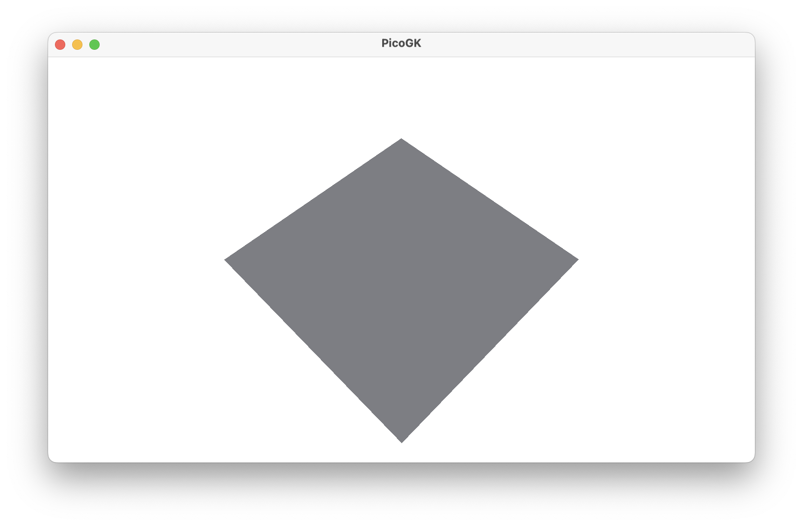
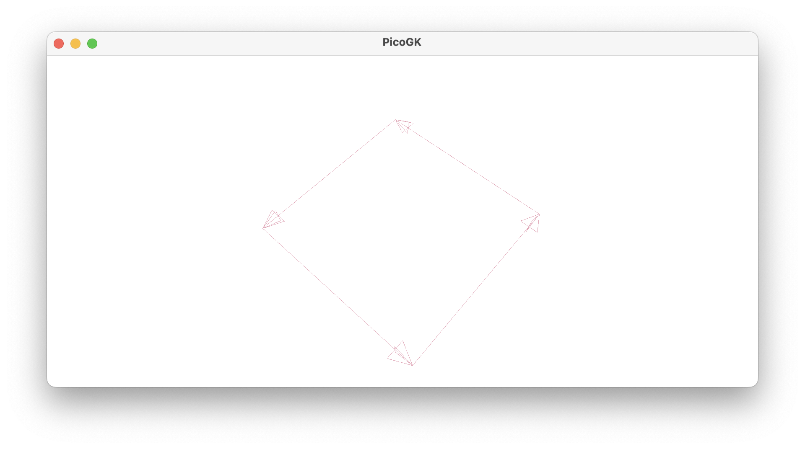

**[PicoGK.org](https://picogk.org)/coding for engineers**


**[Table of contents](TOC.md)**

# Computational geometry (Part 3)

Today we will talk about one of the oldest ways of creating geometry for computers: triangle meshes.

Basically everything you see in 3D on a computer screen is represented by a triangle mesh. That's how graphics cards work. Smooth objects, like spheres, or any of the objects we created at LEAP 71 are simply tessellated into more, increasingly tiny triangles, to approximate the shape.

When you add a `Voxels` object to the viewer the voxels will be converted to triangles, and then uploaded to the graphics card for display. 

It's time to understand this way of building geometry, is, very often, it is perfect for Computational Geometry.

Triangle meshes are made up of vertices. Each of these vertices represents a point in space. Because we often re-use vertices, as most of them are shared in a mesh, it's a good idea to store the vertices separately from the actual triangles. You add vertices to a mesh, and then use the index to that vertex, to actually build your triangle. Let's see how that looks like in PicoGK.

```c#
Mesh msh = new();
int n0 = msh.nAddVertex(new Vector3(0,0,0));
int n1 = msh.nAddVertex(new Vector3(0,5,0));
int n2 = msh.nAddVertex(new Vector3(10,0,0);
```

So now, we have stored the 3 vertices in the `Mesh` object, and in return, we received the index to that vertex, that we can use to build and actual mesh.

```c#
msh.AddTriangle(n0,n1,n2);
```

You can see, how this can be used to build more complex geometric shapes. By encapsulating the creation of the shapes, you can use build very complex objects, without worrying about the details. But it's important to understand the fundamentals, so let's spend a bit of time on this.

In many cases, you will not work with a triangle directly, you will work with quads. Quads are simply rectangle-like shapes, that have four vertices instead of 3. But in the end, a quad always ends up being represented by two triangles, that share one edge, formed by two vertices.

## Let's build a cuboid

Let's embark on the journey to create an elongated cube, a cuboid, in PicoGK, by drawing quads.

Let's start with one quad, which forms the bottom surface, made up of vertices, spaced 10mm apart:

```c#
Vector3[] avec = 
{
    new Vector3(0.0f, 0.0f, 0.0f),
    new Vector3(10.0f, 0.0f, 0.0f),
    new Vector3(10.0f, 10.0f, 0.0f),
    new Vector3(0.0f, 10.0f, 0.0f)
};
```

In case you are wondering about the syntax, this is a very efficient way of creating an array of objects.

An array lets you access each element in the variable by and index, specified in `[]`. The index always starts with `0`, so `avec[0]` points to the first element in the array. `avec[nNumberOfElements - 1]` points to the last one. 

Now let's add the vertices and our first quad.

```c#
Mesh msh = new();
msh.AddVertices(avec, out int[] anV);
msh.AddQuad(anV[0], anV[1], anV[2], anV[3]);
```

We could have added the vertices one-by-one, but there is a handy function that allows us to pass an array of vertices and get an array of vertex indices in return. Then we simply add the quad by specifying the first, second, third, and fourth vertex.

 

So, now we have our first quad on screen, and we can start to imagine building a cube from that.

But first, we have to understand something about meshes. They have an inside and an outside. You can see this clearly in the PicoGK viewer, when you rotate the quad, so you look from below. The quad disappears! Because you are not supposed to look at the inside of a mesh.

What determines what is the outside or the inside of a triangle or quad? The so-called right hand rule determines the direction of the surface normal, and therefore the direction of the face of the mesh. A much simpler way to look at this is: You have to always connect the vertices in a counter-clockwise way, when looking at the outside of a face.

 

So, that's the reason why we can see the face from above, but not from below. When looking at the order of connection of the vertices from below, you will find that they are now ordered clockwise, so we are looking at the inside of the mesh, and that's why we don't see anything, if we look at the face from that angle. 


If you reorder the vertices, so that the order becomes counter-clockwise when viewed from below, the face will be pointing downwards, but will no longer be visible from above.

```c#
msh.AddQuad(anV[3], anV[2], anV[1], anV[0]);
```


So, now we know everything we need to actually build a cube. As you may have guessed, the orientation is now exactly right, because the bottom of our cube should be facing, well, downwards. By the way, the `AddQuad` function has a nice `bFlip` parameter you can use to flip the order around. This is sometimes easier than having to reorder vertices manually. You can then add all sides in the same way, but flip around the ones on the opposite side.

So let's add the missing vertices for our elongated cube, a total of eight.

```c#
Vector3[] avec = 
{
    new Vector3(0.0f, 0.0f, 0.0f),
    new Vector3(10.0f, 0.0f, 0.0f),
    new Vector3(10.0f, 10.0f, 0.0f),
    new Vector3(0.0f, 10.0f, 0.0f),
    new Vector3(0.0f, 0.0f, 15.0f),
    new Vector3(10.0f, 0.0f, 15.0f),
    new Vector3(10.0f, 10.0f, 15.0f),
    new Vector3(0.0f, 10.0f, 15.0f)
};

Mesh msh = new();
msh.AddVertices(avec, out int[] anV);

msh.AddQuad(anV[0], anV[1], anV[2], anV[3], true);
msh.AddQuad(anV[4], anV[5], anV[6], anV[7]);
```

As you can see, we are adding corner 0,1,2,3 for the bottom and corner 4,5,6,7 for the top. We flip around the bottom face so it doesn't look upwards. Now that you added both quads for top and bottom, you have the interesting effect that the bottom is only visible from below and the top is only visible from above. This is of course expected, but can look puzzling anyway. It will get better once we add the sides.


```c#
Mesh msh = new();
msh.AddVertices(avec, out int[] anV);

msh.AddQuad(anV[3], anV[2], anV[1], anV[0]);
msh.AddQuad(anV[4], anV[5], anV[6], anV[7]);
msh.AddQuad(anV[1], anV[5], anV[4], anV[0]);
msh.AddQuad(anV[7], anV[6], anV[2], anV[3]);
msh.AddQuad(anV[4], anV[7], anV[3], anV[0]);
msh.AddQuad(anV[2], anV[6], anV[5], anV[1]);
```

This can be a bit tricky to figure out, but if you label all vertices with their index numbers, it is relatively easy to understand which corner connects with which to make up a face.

Congratulations, you created a cube from a `Mesh` object by hand. 

## Transforming Meshes

The obvious thing is to encapsulate this code into a class, which you can use to build cuboids at your heart's delight.

```c#
class Cuboid
{
    Cuboid(Vector3 vecSize) ...
        
    Mesh mshAsMesh()
    {
        ...
    }
}
```

One interesting thing we could add, is a transformation matrix, that can be used when you return the `Cube` object as a `Mesh` object.

```c#
Cuboid(	Vector3 vecSize,
      	Matrix44 matTransform) ...
```

How would we go about actually creating a transformed mesh? By applying the matrix transformation to every vertex, we can move, scale, rotate our resulting cube.

As usual, the [code for this chapter is on GitHub](https://github.com/LinKayser/Coding4Engineers).

------

Next: **Computational geometry (Part 4)**

[Jump into the discussion here](https://github.com/leap71/PicoGK/discussions/categories/coding-for-computational-engineers)

[Table of contents](TOC.md)

------

**[PicoGK.org](https://picogk.org)/coding for engineers**

© 2024 by [Lin Kayser](https://www.linkedin.com/in/linkayser/) — All rights reserved.