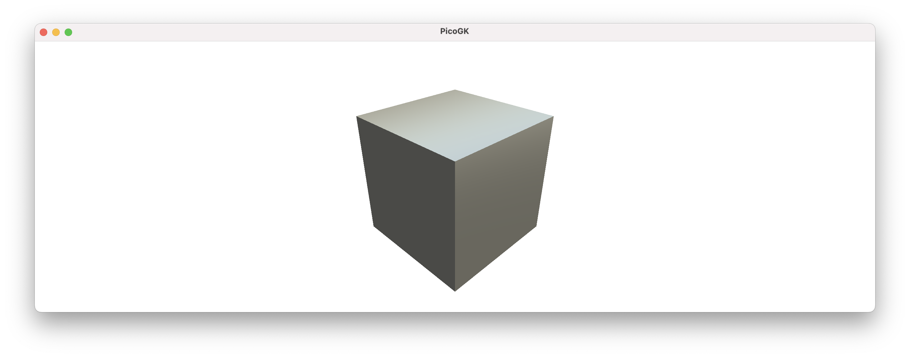
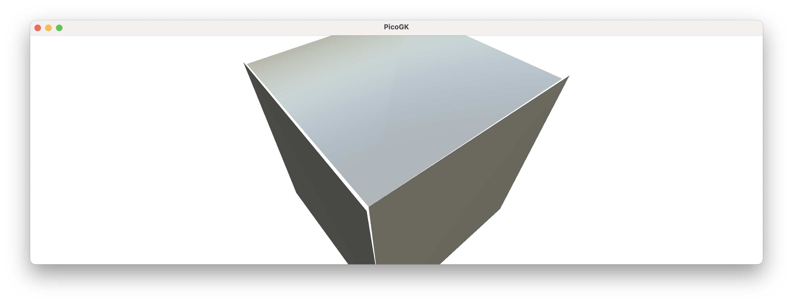
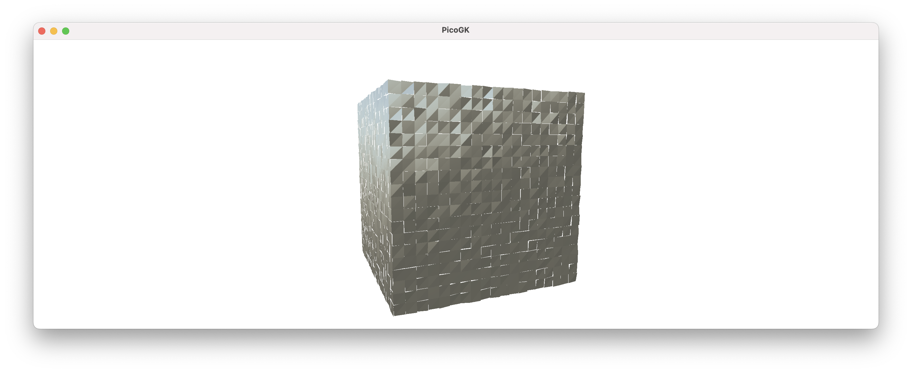
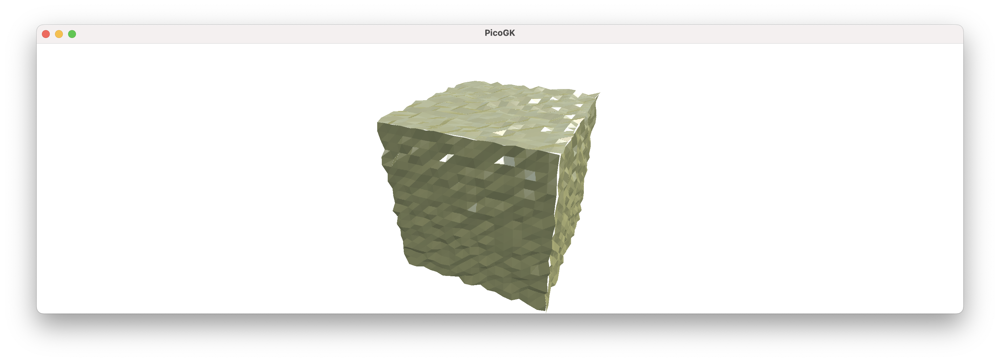
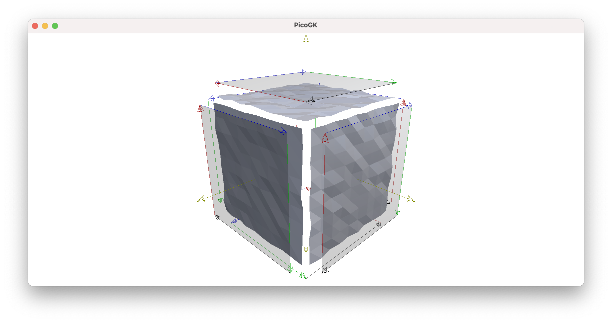
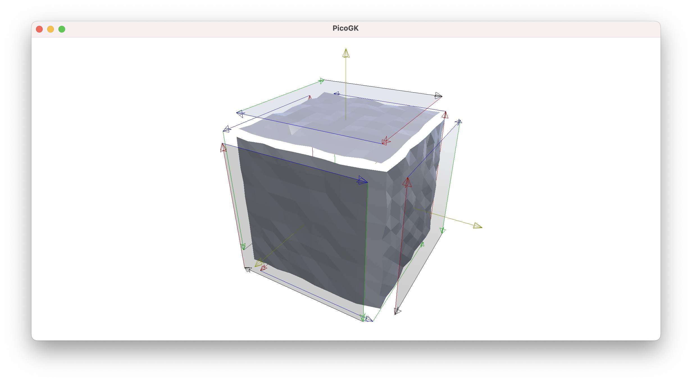
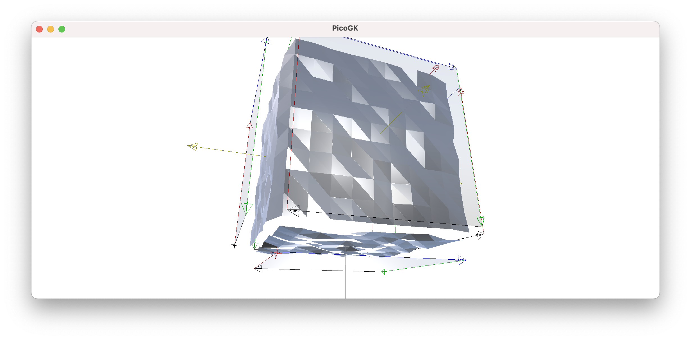
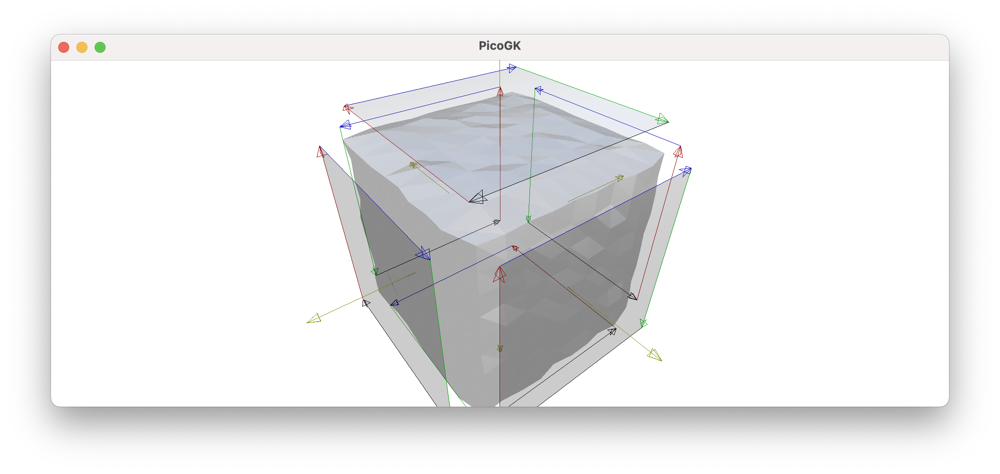
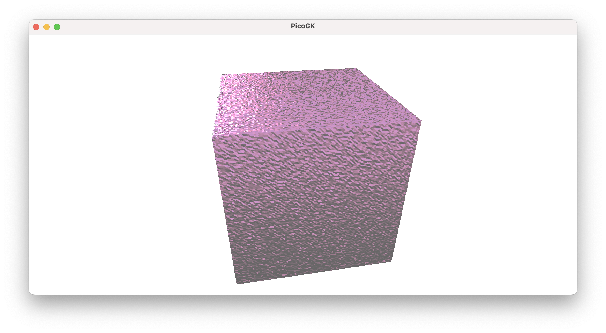
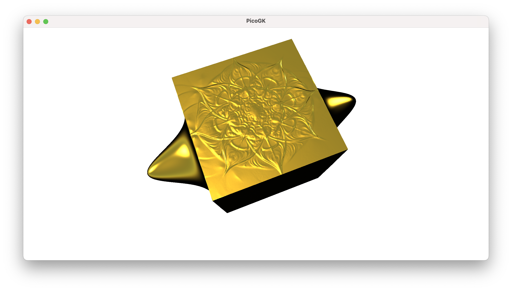

**[PicoGK.org](https://picogk.org)/coding for engineers**


**[Table of contents](TOC.md)**

# Computational geometry (Part 5)

Let's do a quick recap. For the last two chapters, we have been talking about building meshes. 

Things quickly became more complex.

We had to deal with mesh face orientation, which is determined by the winding (clockwise or counter-clockwise) of the vertex order. We had to ensure objects made up of meshes are actually enclosed and do not have any gaps, they have to be *watertight*. 

Meshes become complex quickly, as does any geometry derived from vector math.

In a way, this is the curse of *exact* geometry. Everything needs to be perfect, otherwise small imprecisions can cause all kinds of challenges. If the vertices along the edge of a cube only have "roughly" the same position between different faces, tiny gaps can open up, that make the object non-watertight. You might not be able to see these gaps, but an algorithm might inadvertently encounter the gap and produce an erroneous result — for example by not being able to determine that it is no longer inside an object, because it never was able to cross to the outside — it literally slipped through the cracks.

Of course in reality, nothing is ever infinitesimally precise. This is why a decade ago I got excited about using voxels to represent real-life geometry. Voxels mimic the way reality is — made up of tiny blocks of matter. And precision that goes beyond that resolution is simply discarded, as it is unnecessary.

There is one more thing that adds to the challenge of using vector geometry: 

While math on a computer *looks like math*, it isn't precise. In computer floating-point math, the precision of the binary storage of a number is limited. And this leaves large gaps in the number space. *Many numbers simply do not exist!* They are approximated by the next available number, and that can cause additional issues in complex calculations.

If real math says, you should arrive at the same number when running two different formulas, computer math doesn't necessarily follow. The way you calculate something, the actual steps performed, has an influence on which exact floating point number you end up with. And that —you guessed it — can cause issues for our geometry, for example, for watertightness. When rotating a vector by an angle, for example, you may get slightly different results when doing it from one or the other direction.

Say, you want to do what we did with one face in the last chapter, but with a cube. If you assumed that "perfect math" would ensure watertight edges, you might be surprised that small gaps can open up at the edges, even if your calculations are perfect, simply because of the quirkiness of floating point calculations.

To mitigate these issues, we store vertices separately in a `Mesh` and reference them by their index. If we use the index, it's clear that we want the exact position that is stored in that vertex, and not something that roughly looks similar, but might differ in the Nth decimal place.

This is a very important concept and is called *deduplication*. 

Some people think the point of deduplication of vertices is to reduce the memory footprint of a mesh (because you do not store vertices more than once). This is true (and file formats like 3MF claim this to be their main raison d'être — as if storage space on that level were an issue in today's world). 

But the way more important reason to use a deduplicated vertex storage is to ensure watertightness of meshes, by uniquely identifying a position in space, that is shared by geometric features.

So if we want to create a cube, we should ensure that corners and edges share their vertex indices, making it clear that we are referring to the same place

Let's dive into this, but let me add a final thought: 

You can already see that vector math, meshes, subdivisions, etc. involve a lot of math, which on computers is somewhat flawed. This is why we at LEAP 71 are hesitant to make mesh-based geometry too complex. It's better to use meshes for basic building blocks, and let complex geometry derive from voxel-based combination of relatively simple meshes.

## Objects

If you carefully review the code from the last chapter, you will see that we wrote it in a very function-oriented way. Not much object orientation.

So maybe, it's time we look at this with our object-orientation hat on.

A cube is made up of faces. A cube's face is, fundamentally, made up of a quad, but we want to subdivide it. When we subdivide a face, we end up with a grid of coordinates. This grid can then be used to build new quads that make up our subdivided face. Before we create quads from that grid, we can run a deformation on it, which allows us to modify the shape of the cuboid.

So, our workflow looks roughly like this:

Create 6 faces for our box, each containing a subdivided grid of coordinates. We can now store all of these coordinates in `Mesh`, but we will do it in such a way, that the vertices on the 12 edges (and therefore at the 8 corners), are stored only once, and are referenced in a shared way.

This sounds all very complicated and it's easy to lose orientation. Whenever that happens, go into "building block mode". Instead of trying to solve all of this at once, start with the simplest challenge: How do we store a face?

Well, I guess we can do that.

```c#
public class Face
{
    public Face(	Vector3 vecA,
                  Vector3 vecB,
                  Vector3 vecC,
                  Vector3 vecD)
    {
        m_vecA = vecA;
        m_vecB = vecB;
        m_vecC = vecC;
        m_vecD = vecD;
    }

    public Vector3 vecA => m_vecA;
    public Vector3 vecB => m_vecB;
    public Vector3 vecC => m_vecC;
    public Vector3 vecD => m_vecD;  

    Vector3 m_vecA;
    Vector3 m_vecB;
    Vector3 m_vecC;
    Vector3 m_vecD;
}
```

Note that I am making the coordinates of the `Face` object available as properties, by using the syntax `public Vector3 vecA => m_vecA;` — we could have also created an access function (or used public variables, but this is frowned upon). 

Now, we want to subdivide the face, and return a grid of coordinates.  We have done that before, we just have to encapsulate it in a class.

```c#
public class Grid
{
    public Grid(    Face oFace,
                    int nSubdivU,
                    int nSubdivV)
    {
        m_avecGrid = new Vector3 [nSubdivWidth,nSubdivHeight];

        for (int u = 0; u < nSubdivU; u++)
        {
            for (int v = 0; v < nSubdivV; v++)
            {
                // Calculate normalized interpolation factors
                float fTU = (float)u / (nSubdivU - 1); // Horizontal interpolation (0 to 1)
                float fTV = (float)v / (nSubdivV - 1); // Vertical interpolation (0 to 1)

                // Perform bilinear interpolation
                // Interpolate along the top and bottom edges
                Vector3 vecTopEdge      = Vector3.Lerp( oFace.vecA, 
                                                        oFace.vecB,
                                                        fTU);

                Vector3 vecBottomEdge   = Vector3.Lerp( oFace.vecD, 
                                                        oFace.vecC, 
                                                        fTU);

                // Interpolate between the top and bottom edges
                m_avecGrid[u, v] = Vector3.Lerp(vecTopEdge, vecBottomEdge, fTV);
            }
        }
    }

    Vector3 [,] m_avecGrid;
}
```

So, we can now create a `Face` from four coordinates. We can pass that `Face` into a `Grid` object, supplying subdivision numbers. Note, that I called the coordinate not `X` or `Y`, but `U` and `V`. Since I want to distinguish them from the `X,Y,Z` coordinates that may be stored inside the vertices. It is common to refer to the surface coordinates of an object as `U/V`. So `U/V` make up the two-dimensional coordinates while traveling across a surface of a `Face`.

As a result of the process, we end up with a two-dimensional array inside the `Grid` object, which represents all interpolated vertex coordinates.

Now it's time to go back to our `BaseBox` object from Chapter 15.

## Building a box

Let's look at the `mshConstruct` method from our `BaseBox` class.

```c#
public Mesh mshConstruct()
{
    Vector3[] avec = 
    {
        new Vector3(-1.0f, -1.0f, -1.0f),
        new Vector3( 1.0f, -1.0f, -1.0f),
        new Vector3( 1.0f,  1.0f, -1.0f),
        new Vector3(-1.0f,  1.0f, -1.0f),
        new Vector3(-1.0f, -1.0f,  1.0f),
        new Vector3( 1.0f, -1.0f,  1.0f),
        new Vector3( 1.0f,  1.0f,  1.0f),
        new Vector3(-1.0f,  1.0f,  1.0f)
    };

    Mesh msh = new();
    int[] anV = new int[avec.Count()];

    int n=0;
    foreach (Vector3 vec in avec)
    {
        anV[n] = msh.nAddVertex(Vector3.Transform(vec, matTransform));
        n++;
    }

    msh.AddQuad(anV[3], anV[2], anV[1], anV[0]);
    msh.AddQuad(anV[4], anV[5], anV[6], anV[7]);
    msh.AddQuad(anV[1], anV[5], anV[4], anV[0]);
    msh.AddQuad(anV[7], anV[6], anV[2], anV[3]);
    msh.AddQuad(anV[4], anV[7], anV[3], anV[0]);
    msh.AddQuad(anV[2], anV[6], anV[5], anV[1]);

    return msh;
}
```

Let's modify it, to create `Face` objects instead of quads.

```c#
public Mesh mshConstruct()
{
    List<Vector3> avec = new()
    {
        new Vector3( 1, -1, -1), // 0: Front Bottom-Right
        new Vector3(-1, -1, -1), // 1: Front Bottom-Left
        new Vector3(-1, -1,  1), // 2: Front Top-Left
        new Vector3( 1, -1,  1), // 3: Front Top-Right
        new Vector3(-1,  1, -1), // 4: Back Bottom-Right
        new Vector3( 1,  1, -1), // 5: Back Bottom-Left
        new Vector3( 1,  1,  1), // 6: Back Top-Left
        new Vector3(-1,  1,  1), // 7: Back Top-Right
    };

    Face oFront     = new(avec[0], avec[1], avec[2], avec[3]); 
    Face oBack      = new(avec[4], avec[5], avec[6], avec[7]);
    Face oRight     = new(avec[5], avec[0], avec[3], avec[6]);
    Face oLeft      = new(avec[1], avec[4], avec[7], avec[2]);
    Face oTop       = new(avec[7], avec[6], avec[3], avec[2]);
    Face oBottom    = new(avec[1], avec[0], avec[5], avec[4]);
...
```

And just to debug it, let's add a function that allows us to add the faces to a `Mesh`, so we can see if we are doing the right thing:

```c#
    Mesh msh = new();
                
    oBottom .AddTo(msh);
    oTop    .AddTo(msh);
    oBack   .AddTo(msh);
    oFront  .AddTo(msh);
    oRight  .AddTo(msh);
    oLeft   .AddTo(msh);

    return msh;
}
```



OK, looks like we have the same result as before. But no, it's not the same. We are *not* using shared coordinates for the shared edges. The coordinates may look the same (and in our case, they are actually the same floating point number), but they reference different vertex IDs. If we applied more calculations to the vertices, we could end up with a non-watertight mesh.

Here's an exaggerated illustration, which I got by adding a small random number to each coordinate. The annoying thing is that you usually don't see these things.



Let' move on to subdivision and see how that works. We will pass each `Face` to a `Grid` object and add a function to the `Grid` object to add itself to a `Mesh`.

The `AddTo` function is straightforward, and again, we are using non-deduplicated vertices, since we just want to see if our result is visually correct:

```c#
public void AddTo(Mesh msh)
{
    for (int u = 0; u < m_avecGrid.GetLength(0)-1; u++)
    {
        for (int v = 0; v < m_avecGrid.GetLength(1)-1;v++)
        {
            Vector3 vec0 = m_avecGrid[u, v];
            Vector3 vec1 = m_avecGrid[u, v + 1]; 
            Vector3 vec2 = m_avecGrid[u + 1, v + 1];
            Vector3 vec3 = m_avecGrid[u + 1, v];
            msh.AddQuad(vec0, vec3, vec2, vec1);
        }
    }
}
```

Let's modify our `mshConstruct` function to create grids.

```c#
    int nSubDiv = 20;

    Grid oGridBottom    = new(oBottom,  nSubDiv, nSubDiv);
    Grid oGridTop       = new(oTop,     nSubDiv, nSubDiv);
    Grid oGridBack      = new(oBack,    nSubDiv, nSubDiv);
    Grid oGridFront     = new(oFront,   nSubDiv, nSubDiv);
    Grid oGridRight     = new(oRight,   nSubDiv, nSubDiv);
    Grid oGridLeft      = new(oLeft,    nSubDiv, nSubDiv);

    Mesh msh = new();

    oGridBottom .AddTo(msh);
    oGridTop    .AddTo(msh);
    oGridBack   .AddTo(msh);
    oGridFront  .AddTo(msh);
    oGridRight  .AddTo(msh);
    oGridLeft   .AddTo(msh);

    return msh;
}
```



Again, added a bit of randomness to show that each vertex lives on its own, and cannot be relied upon to form a watertight mesh.

So, let's change the storage format of our `Grid`, so that it doesn't store coordinates, but indices to the coordinates. To do that, we need to give it a shared `Mesh` object to store the vertices in. The vertices in this mesh will be shared by all six faces.

Here's what happens when we do this:



With the randomness added to exaggerate again, you can see that all subdivided quads on each face share their border vertices, and the only area where these edges don't align is where each face interfaces with the other faces.

Since neither the `Face` nor the `Grid` object know they are part of a larger object, this is not surprising.

Let's first look at how we arrived on the deduplicated `Grid`.

Here's the constructor. I added a `Mesh` object, that is used just to serve as a way to store all vertices for a grid. Instead of storing the vertices in our grid, we now store the index to the coordinate in our grid.

```c#
public Grid(    Face oFace,
                Mesh mshVertexStorage,
                int nSubdivU,
                int nSubdivV)
{
    Random rnd = new();

    m_msh = mshVertexStorage;
    m_anGrid = new int [nSubdivU,nSubdivV];

    for (int u = 0; u < nSubdivU; u++)
    {
        for (int v = 0; v < nSubdivV; v++)
        {
            // Calculate normalized interpolation factors
            float fTU = (float)u / (nSubdivU - 1); // Horizontal interpolation (0 to 1)
            float fTV = (float)v / (nSubdivV - 1); // Vertical interpolation (0 to 1)

            // Perform bilinear interpolation
            // Interpolate along the top and bottom edges
            Vector3 vecBottomEdge      = Vector3.Lerp(  oFace.vecBL, 
                                                        oFace.vecBR,
                                                        fTU);

            Vector3 vecTopEdge   = Vector3.Lerp(    oFace.vecTL, 
                                                    oFace.vecTR, 
                                                    fTU);


            Vector3 vecInterpolated = Vector3.Lerp(vecBottomEdge, vecTopEdge, fTV);
            vecInterpolated += (0.4f + rnd.NextSingle() *.1f) * oFace.vecN ;

             // Interpolate between the top and bottom edges
            m_anGrid[u, v] = mshVertexStorage.nAddVertex(vecInterpolated);
        }
    }
}
```

Now we rewrite our `AddTo` function, because it already knows the `Mesh` object to reference. Let's call it `Construct` and instead of directly adding vertices, we just add quads using the vertex indices we stored previously.

```c#
public void Construct()
{
    for (int u = 0; u < m_anGrid.GetLength(0)-1; u++)
    {
        for (int v = 0; v < m_anGrid.GetLength(1)-1;v++)
        {
            int n0 = m_anGrid[u, v];
            int n1 = m_anGrid[u, v + 1]; 
            int n2 = m_anGrid[u + 1, v + 1];
            int n3 = m_anGrid[u + 1, v];

            m_msh.AddQuad(n3, n2, n1, n0);
        }
    }
}
```

OK, so far, so good. Now comes a bit of mind work. We now have to find a way to to replace the edge indices of one face with the edge indices of its adjacent face. 

Whenever you have to do something like that in 3D, usually your brain starts to gyrate, and it's easy to get lost.

The best way to do something like this is — simplify. Look at one face, the front face, for example, and rotate it in your mind, so you look straight at it. It now has a top, bottom, left, right edge. The front face is attached to the right face, using the right face's left edge. The left face is attached to the front face's right face, etc.



In this visualization, I added color indicators which show, which edge we are looking at, top is blue, bottom is black, left is red, and right is green (sky is blue, ground is dark, and left and right correspond to backboard, starboard navigational lights on a ship, if you'd like to understand the logic of the colors).

So, if we replace the vertex indexes in the front face's right edge with right face's left edge, they will reference the same vertex indexes — now they truly share an edge.

OK, let's try this with front face and see what we get:



Very nice, while the top and left side is clearly disconnected, our shared edge between right and front now share their vertices, and all the distortion in the world cannot disconnect them.

How did we do this? We quite literally write:

```c#
oGridFront.ReplaceRightEdge(oGridRight.anLeftEdge());
```

How do these functions look like?

```c#
public void ReplaceRightEdge(int [] anEdge)
{
    if (anEdge.Length != m_anGrid.GetLength(1))
        throw new IndexOutOfRangeException();

    for (int v=0;v<m_anGrid.GetLength(1);v++)
    {
         m_anGrid[m_anGrid.GetLength(0)-1,v] = anEdge[v];
    }
}
```

and

```c#
public int [] anLeftEdge()
{
    // U direction
    int [] anEdge = new int [m_anGrid.GetLength(1)];

    for (int v=0;v<m_anGrid.GetLength(1);v++)
    {
        anEdge[v] = m_anGrid[   0,
                                v];
    }

    return anEdge;
}
```

Now, we can simply repeat this all around:

```c#
oGridFront. ReplaceRightEdge(oGridRight.    anLeftEdge());
oGridLeft.  ReplaceRightEdge(oGridFront.    anLeftEdge());
oGridBack.  ReplaceRightEdge(oGridLeft.     anLeftEdge());
oGridRight. ReplaceRightEdge(oGridBack.     anLeftEdge());
```

and we have connected all edges of the faces, except for the top and bottom one.



Now, let's just replace all the edges of the top face with the top edges of the other faces:

```c#
oGridTop.ReplaceTopEdge     (oGridFront.    anTopEdge());
oGridTop.ReplaceRightEdge   (oGridLeft.     anTopEdge());
oGridTop.ReplaceBottomEdge  (oGridBack.     anTopEdge());
oGridTop.ReplaceLeftEdge    (oGridRight.    anTopEdge());
```



Looking good, top and sides are closed, now let's do it for the bottom, by replacing all edges with the bottom edges of the other faces:

```c#
oGridBottom.ReplaceTopEdge     (oGridBack.  anBottomEdge());
oGridBottom.ReplaceRightEdge   (oGridLeft.  anBottomEdge());
oGridBottom.ReplaceBottomEdge  (oGridFront. anBottomEdge());
oGridBottom.ReplaceLeftEdge    (oGridRight. anBottomEdge());
```



And here we go, we finally have a closed box, with shared vertices all over. We can now deform each face at our heart's desire, without worrying about the mesh becoming non-watertight, through gaps opening somewhere.

However there is still one thing to keep in mind. Each face can only be deformed along it's orientation. If you wanted to shift the points in other directions, you could mess up the mesh. However, you no longer have to worry about seams opening up at the edges, if you apply this up/down transformation on each face.

## Summing it up and encapsulating the transformation

OK, that was a lot of mind bending. Usually these kinds of things are hidden behind an optimized implementation that deals with the edges directly when you build the base object. But by going step-by-step, we were able to see how it all fits together.

You can probably also appreciate, how quickly things can go complex when you deal with meshes, ensuring they always form a watertight seamless object.

As a last step, let's encapsulate the surface modulation in an interface, and apply it to each face of the cube.

```c#
public interface IModulation
{
    /// <summary>
    /// Abstracts the modulation of a surface
    /// </summary>
    /// <param name="vecUV">Local x/y coordinate of the surface, 0..1</param>
    /// <returns>Absolute height of the modulated surface</returns>
    float fHeight(Vector2 vecUV);
}
```

So, we pass the coordinate of our vertex into the` fHeight` function and receive back the height that we need to move it, perpendicular to the face.

Let's implement this for an image:

```c#
public class ModulationImage : IModulation
{
    public ModulationImage(Image img)
    {
        m_img       = img;
    }

    public float fHeight(Vector2 vecUV)
    {
        int nX = (int) float.Round(vecUV.X * m_img.nWidth);
        int nY = (int) float.Round(vecUV.Y * m_img.nHeight);

        return m_img.fValue(nX, nY);
    }

    Image m_img;
}
```

So, all we do is read the grayscale value from the image, and return it in the function.

Since we way want to flip the axes, scale the value, etc. it may be a good idea to create another class that can handle all of this generically. So here is a class that can apply all of these transformations to a generic `IModulation`:

```c#
public class ModulationTrans : IModulation
{
    public ModulationTrans(   IModulation xModulation,
                              float   fScale    = 1,
                              float   fOffset   = 0,
                              bool    bFlipU    = false,
                              bool    bFlipV    = false)
    {
        m_xModulation   = xModulation;
        m_fScale        = fScale;
        m_fOffset       = fOffset;
        m_bFlipU        = bFlipU;
        m_bFlipV        = bFlipV;
    }

    public float fHeight(Vector2 vecUV)
    {
        if (m_bFlipU)
            vecUV.X = 1.0f - vecUV.X;

        if (m_bFlipV)
            vecUV.Y = 1.0f - vecUV.Y;

        return m_xModulation.fHeight(vecUV) * m_fScale + m_fOffset;
    }

    IModulation m_xModulation;
    float       m_fScale;
    float       m_fOffset;
    bool        m_bFlipU;
    bool        m_bFlipV;
}
```

So, if you want to flip the image in U, you simply create a surface modulation like this:

```c#
IModulation xModImg = new ModulationImage(img);
IModulation xModTrn = new (xModImg, bFlipU: true);
```

Notice, how I used a named parameter, so I can just set the desired transformation without having to set all default parameters.

As a last step, let's figure out how we can actually apply this to our `BaseBox`.

First, let's add the relevant parameters to our `mshConstruct` function. 

```c#
public Mesh mshConstruct(   IModulation xFront,
                            IModulation xBack,
                            IModulation xTop,
                            IModulation xBottom,
                            IModulation xLeft,
                            IModulation xRight,
                            int nSubDivU = 0,
                            int nSubDivV = 0)
```

Then, let's handle the modulation in our `Grid` constructor.

```c#
public Grid(    Face oFace,
                Mesh mshVertexStorage,
                int nSubdivU,
                int nSubdivV,
                Surface.IModulation xModulation)
```

While we are at it, we should probably handle the safe range of the subdivision parameters, as it should be never less than 2 (you have to have at least two edges in each dimension).

```c#
// Needs to have at least two edges
if (nSubdivU < 2)
    nSubdivU = 2;

if (nSubdivV < 2)
    nSubdivV = 2;
```

Now, how to we apply the modulation of the vertex displacement? We simply multiply the return value of the `xModulation.fHeight` with the *normal* of the face. The normal is perpendicular to the face and points outwards, that's exactly what we want. It is also normalized, so it has always a length of 1.

```c#
Vector3 vecInterpolated = Vector3.Lerp(vecBottomEdge, vecTopEdge, fTV);
vecInterpolated += xModulation.fHeight(new(fTU, fTV)) * oFace.vecN;
```

And that's fundamentally it.

I added a few example surface interpolations, and here is the result from this code:

```c#
IModulation xImg    = new ModulationImage(img);
IModulation xTop    = new ModulationTrans(xImg, 0.02f);
IModulation xBottom = new ModulationGauss();
IModulation xLeft   = new ModulationRandom(0.001f);
IModulation xRight  = new ModulationNoop();
IModulation xBack   = xBottom;
IModulation xFront  = xBottom;

BaseBox oBox = new();
Mesh msh = oBox.mshConstruct(   xTop:       xTop,
                                xBottom:    xBottom,
                                xFront:     xFront,
                                xBack:      xBack,
                                xLeft:      xLeft,
                                xRight:     xRight,
                                nSubDivU:   500, 
                                nSubDivV:   500);

Library.oViewer().Add(msh);
```



Not bad, isn't it.


It also demonstrates, how you can create relatively complex objects from simple base shapes, by modifying them algorithmically.

## Summary

This was a lot of geometry and a lot of code. Basically all of it dealt with just ensuring our mesh stayed valid when we apply transformations to it. In the next chapter, we will work through our code again, identify what we actually need to keep, and then add one more useful transformation to give you an impression how powerful the modification of a base shape is.

As usual, the [code for this chapter is on GitHub](https://github.com/LinKayser/Coding4Engineers). For better readability, the code is split into multiple `.cs` files. 

------

Next: **Computational geometry (Part 6)**

[Jump into the discussion here](https://github.com/leap71/PicoGK/discussions/categories/coding-for-computational-engineers)

[Table of contents](TOC.md)

------

**[PicoGK.org](https://picogk.org)/coding for engineers**

© 2024-2025 by [Lin Kayser](https://www.linkedin.com/in/linkayser/) — All rights reserved.