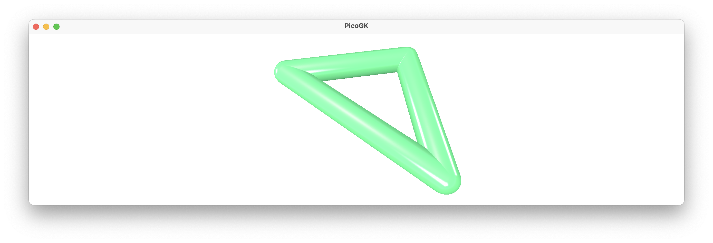
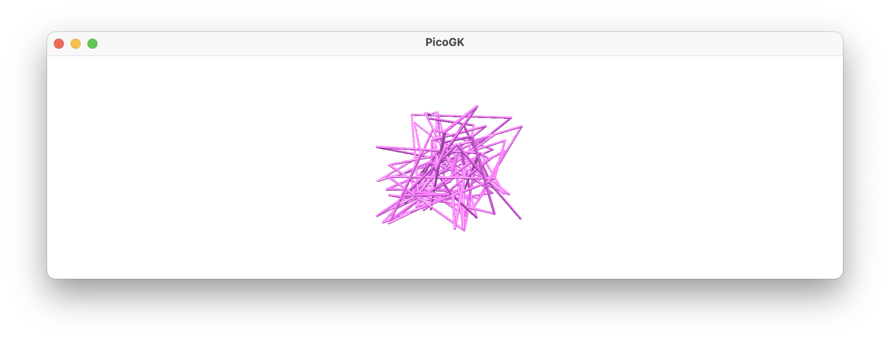
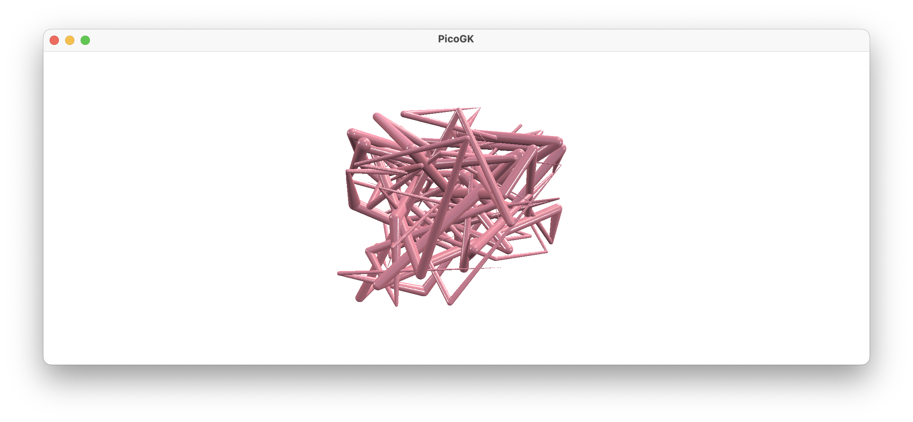
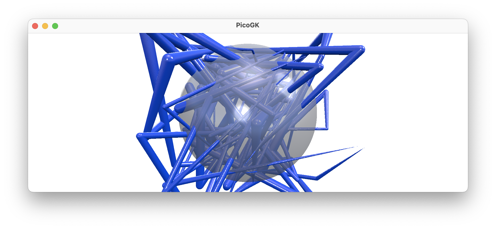

**[PicoGK.org](https://picogk.org)/coding for engineers**


[0 — Preamble: My story](README.md)

[1 — Foreword](1-foreword.md)

[2 — Fundamentals](2-fundamentals.md)

[3 — Running Code](3-running-code.md)

[4 — Classes](4-classes.md)

[5 — Inheritance](5-inheritance.md)

[6 — Interfaces](6-interfaces.md)

[7 — Design an aircraft in an afternoon](7-design-an-aircraft-in-an-afternoon.md)

**[8 — First steps in PicoGK](8-first-steps-in-picogk.md)**

# First steps in PicoGK

Until now, we have talked about programming in general and have understood how to fundamentally structure code.

In the last chapter, I gave a very high-level overview, on how you would go about setting up a computational model for a physical object.

But I have avoided building geometry so far. This is intentional. 

Because of the way engineers work today, the object's appearance, the CAD "drawing", with all its details, naturally is in the focus. But for a Computational Engineering Model, the logical structure and the flow of information is equally as important. And all the things you learned, about classes, interfaces, constructors, etc. all prepared you for what comes next: Working with PicoGK, the geometry kernel I created in 2023, and which forms the basis for [all of our work at LEAP 71](https://leap71.com/gallery/).


PicoGK stands for **Pico** (tiny) **G**eometry **K**ernel, because it is just that: a shape engine that is [intentionally reduced to the max](https://jlk.ae/2023/12/06/the-power-of-reduced-instruction-sets/). PicoGK is pronounced "peacock", as a nod to our feathery companions roaming the streets Dubai, of our hometown.

PicoGK is different from traditional CAD kernels, because it has to be. CAD uses complex vector math in an attempt to define *perfect* geometric shapes. The desire to be perfect, however, is thwarted by the way computers represent math. 

Even though floating point numbers looks like the stuff you learned at school, they are subtly different. [Because of the way computers represent numbers, certain values simply don't exist](https://en.wikipedia.org/wiki/Floating-point_arithmetic#Accuracy_problems). The space of floating point numbers is rough terrain to navigate. As a result, it's incredibly complex to try to do achieve perfection using vectors, without running into numerical instabilities. You pile imperfect math onto imperfect math, while you build a complex shape. Anyone who has used CAD knows the challenges. Sometimes stuff that should work, doesn't. "Cannot perform boolean operation" is one message everyone dreads.

I will not dwell on this, because PicoGK works differently — and it approaches the problem from another angle.

## Voxels

The underlying data type for PicoGK are voxels. Voxels are, simply said, three-dimensional pixels. Just like pixels, voxels have a resolution that you have to choose. Every voxel has a size, details below that size cannot be expressed. Choose the voxel resolution too coarsely, objects will look pixelated. Voxels avoid the perfection of vector curves, and pragmatically work with the detail size which makes sense for the object you want to manufacture. No physical object is perfectly smooth. 3D-printed objects, like the ones we will often target with computational workflows, have a resolution that is determined by the printer. Other manufacturing processes have tolerances as well, so it makes sense to use them to guide our voxel resolution.

Voxels have the huge advantage that they are robust. Once rendered into voxels, geometry is unbreakable. Just like there cannot be any argument about the existence or non-existence of a pixel in a digital photograph, like you can just go in and edit, combine, erase pixels in a 2D picture, you can do the same in three dimensions.

I have written extensively about the [fundamentals of PicoGK in a series of articles in published in October 2023](https://jlk.ae/2023/10/06/computational-engineering-part-1-history/), and if you want to go deeper, I encourage you to read through. 

But since last chapter was all theory, and little code, this chapter will dive right in.

## Lattices

You don't want to draw a rocket engine (or really anything) voxel by voxel, even though the underlying data format are these tiny 3D pixels. Just like any modern photo editor allows you to draw shapes, that are then transformed into the raster image, you will work with higher-level 3D shapes in PicoGK.

And this is one important aspect to keep in mind — just because we render our shapes into voxels as the underlying data type, it doesn't mean that the computational model, the logic and the mathematical expressions that we feed as geometry into the voxel field are trivial. Quite the opposite. Computational models can create objects of awesome complexity, built on complex math and sophisticated logic. 

But by using voxels, we can avoid stacking too much of this logic and math on top of each other, creating fragile interdependencies. By rendering to voxels and then using that result as the basis for our next step, we avoid the numerical instabilities that haunt CAD kernels.

So let's introduce some of these higher level ways of interacting with the voxel field.

Let's start with lattices. A `Lattice` object in PicoGK can contain spheres or lattice beams. A sphere has a radius in millimeters, a lattice beam has two radii, one at each end, and it can have a flat bottom and top, or a rounded one.

One lattice beam, defined that way, is already quite versatile, as you can use it to draw cylinders, cones, including rounded ones.

Here are a few shapes created using different lattice parameters.


Let's see how this looks like in code:

```c#
Lattice lat = new();
			
lat.AddBeam(    new Vector3(0,0,0),
                new Vector3(50,0,0),
                5, 20,
                true);

Voxels vox = new(lat);
```

Which gives us this result:


The first line creates a new (empty) lattice object. In the second line we add a beam to it. To do that, we use the 3D vector objects built into C#, called `Vector3`. The first vector has the coordinate `0,0,0` which is the beginning of the beam, the second vector is 50mm down the X axis.

The first radius (which is on the right side of the above image), is set to 5mm, the second radius is 20mm. Lastly, we set the rounded cap parameter to true, which gives us the nice domes at the end. 

In the last line, we convert the lattice object, which so far is just a mathematical formula, to a `Voxels` object to materialize it. The `Voxels` class has a constructor which takes a `Lattice` object, and uses the information from the lattice beams it contains, to render them into three-dimensional pixels, we call this process *voxelizing*.

Now let's take this a little further. A lattice can contain many beams. Let's try this:

```c#
Lattice lat = new();
			
lat.AddBeam(    new Vector3(0,0,0),
                new Vector3(50,0,0),
                5, 5, true);

lat.AddBeam(    new Vector3(50,0,0),
                new Vector3(50,50,0),
                5, 5, true);

lat.AddBeam(    new Vector3(50,50,0),
                new Vector3(0,0,0),
                5, 5, true);

Voxels vox = new(lat);
```




With just a few lines of code, we have created a 3D triangle. A bit of imagination, and you can visualize how some of the complex objects you may have seen [on the LEAP 71 website](https://leap71.com/gallery/) have come about. Combined with a capable algorithm, with lattices alone, you can create quite sophisticated shapes. By using a voxel field, you can literally paint objects in space using lattices as a brush.

But lattices are still quite close to the geometry we use in CAD, and we haven't really explored the advantages of `Voxels` at all. 

Let's talk about *Boolean* operations. 

## Boolean operations

Boolean operations in voxels are extremely powerful. Just like you can merge two pictures in Photoshop by overlaying them, you can do the same in 3D using Voxels. Let's create a hollow pipe from two lattices.


How did we do this? Let's look at the code:

```c#
Lattice latOutside = new();
latOutside.AddBeam(    new Vector3(0,0,0),
                       new Vector3(50,0,0),
                       10, 10, false);

Lattice latInside = new();
latInside.AddBeam(	new Vector3(0,0,0),
                    new Vector3(50,0,0),
                    8, 8, false);

Voxels voxOutside  = new(latOutside);
Voxels voxInside   = new(latInside);

voxOutside.BoolSubtract(voxInside);
```

So this should look fairly familiar. But instead of one `Lattice` we create two. One for the outside of the pipe, with a radius of 10mm. Then a second one for the inside volume of the pipe, with a radius of 8mm. 

After voxelizing both, we have two solid `Voxels` objects. In the last step, we subtract the inside from the outside. Now the voxel field `voxOutside` has an empty space, where the `voxInside` object was. We have a pipe.

Boolean operations are amongst the most powerful functionality in PicoGK. They do exist in vector-based CAD systems, but are notoriously unreliable, because of the extremely complex math involved — so people avoid them. Owing to the nature of voxels as a data format, booleans are rock-solid and fast. You can build complex objects through repeated boolean additions, subtractions and intersections, without ever having to worry about the objects getting corrupted or messy.

## Running PicoGK

Time to get you up and running with PicoGK. Please [follow the instructions in the PicoGK documentation](https://github.com/leap71/PicoGK/tree/main/Documentation) to install the runtime and run your first example. Then come back, and we can continue.

You can either create a new PicoGK app, based on the steps in the documentation, or modify the example which is supplied by the [PicoGK installer](https://github.com/leap71/PicoGK/releases).

As we know from the previous chapters, every application in C# has a `Program.cs`, which contains the body of the app.

When you run PicoGK, your `Program.cs` will look something like this:

```c#
PicoGK.Library.Go(0.5f, Coding4Engineers.LatticeExample.Task);
```

And that's it.

Let's dissect the code:

- `Library` is a class contained in the `PicoGK` namespace. 

- `Go` is a function implemented in the `Library` class, which takes two (or more) parameters.

- The first parameter is the voxel resolution in millimeters. 

- The second parameter is the function which should be executed by the library. 

In the example above, the function `Task`is implemented in a class named `LatticeExample`, which is contained in the namespace `Coding4Engineers`.

## Catching exceptions

Before we go further, let's add something to our `Program.cs`, that helps us understand if something goes wrong.

```c#
try
{
    PicoGK.Library.Go(0.5f, Coding4Engineers.LatticeExample.Task);
}

catch (Exception e)
{
    Console.WriteLine(e.ToString());
}
```

We have not talked about *Exceptions* yet. Exceptions in C# are objects that you can literally *throw*, when something goes wrong. It looks like this:

```c#
/// some code
if (bSomethingWentWrong)
    throw new Exception("Something really bad happened");

/// and in this case, you will not get to this part of the code
```

When you throw an exception, the code you are executing is interupted immediately, and you end up in the `catch` block. The `catch` block, receives the exception object, and can do something, for example report an error, etc.

I don't want to go deeper into this, as using exceptions requires more explanation. For now, let it suffice: Whenever the code executed in a `try` block throws an `Exception`, we will end up in the `catch` block, which will, in our case, simply write the explanation of what happens to the `Console`.

In other words, if an error happens during the execution of `Library.Go`, the `Exception` object `e` in our `catch` block, will tell us what went wrong.

Now let's look at the actual implementation of the examples above in PicoGK.

Everything you see here should look generally familiar, as it builds upon the knowledge we learned in the previous chapters.

```c#
using PicoGK;
using System.Numerics;

namespace Coding4Engineers
{
    class LatticeExample
    {
        public static void Task()
        {
            Lattice latOutside = new();
            latOutside.AddBeam( new Vector3(0,0,0),
                                new Vector3(50,0,0),
                                10, 10, false);

            Voxels voxOutside = new(latOutside);

            Lattice latInside = new();
            latInside.AddBeam(  new Vector3(0,0,0),
                                new Vector3(50,0,0),
                                8, 8, false);

            Voxels voxInside = new(latInside);

            voxOutside.BoolSubtract(voxInside);

            Library.oViewer().Add(voxOutside);
        }
    }
}
```

Let's start with the second line: `using System.Numerics`. 

`System` is the main namespace for the C# runtime. The sub namespace `Numerics` adds many numerical classes, such as `Vector3`, which we use.

We define our own `namespace Coding4Engineers`. 

In it, we implement a class called `LatticeExample`. Our class really has no data members and will never be instantiated using `new`. The only reason it exists is to provide a function named `Task`, in which we do all of our work.

We mark this function as `static`, as it is a function that can be called without creating an instance of the class. We will dive into this in more detail some other time.

Let's look at the function body, which should look largely familiar. There is really just one line that is different to what I already showed above: the last one in the function:

```c#
Library.oViewer().Add(voxOutside);
```

This statement adds the result of our hollow pipe to the PicoGK viewer, to make it visible.

And that's fundamentally it, this is one way to create geometry in PicoGK. You should be able to play around with lattices, including complex ones, and do interesting things. 

## Looping with `for` loops

To give you an impression how powerful this is, let's have a bit of fun. Let's draw 100 random connected lattices beams and show them. Like this:

 

Let's look at the code:

```c#
public static void Task()
{
    Lattice lat         = new();     
    Vector3 vecPrevious = new(0,0,0);
    Random  oRand       = new();

    for (int n=0; n<100; n++)
    {
        Vector3 vecNew = new(   oRand.NextSingle() * 100,
                                oRand.NextSingle() * 100,
                                oRand.NextSingle() * 100);
            
        lat.AddBeam(    vecPrevious,
                        vecNew,
                        1, 1, true);

        vecPrevious = vecNew;
    }

    Voxels voxLat = new(lat);
    Library.oViewer().Add(voxLat);
}
```

So, in the first line of our task function, we create a new empty lattice, nothing new here.

In the second line we create a `Vector3` which stores the previous end point of the lattice beams, so that we can connect them all.

In the third line we create a new random number generator object. It allows us to create random numbers for the end points of the vectors.

Now we run a loop. A `for` loop is a simple construct, but it can look a bit intimidating at first. So let's dissect it.

The first statement that is executed in the for `()` bracket creates a new integer variable called `n` and assigns it a value of `0`. This command is executed at the beginning of the for loop. So the loop starts with `n=0`. 

The second part of the for loop is the loop condition. As long as it is true, the loop will continue. In our case this is `n<100`, which means, the loop will run as long as `n` is smaller than `100`. In other words, our loop will run for 100 times, with the first number of `n` being `0` and the last being `99`. As soon as the number hits `100`, `n<100` is no longer true, and the loop ends. 

The last statement defines what should be done *after* each loop and before the next one. In our case, we increment the number `n` by using the operator `++` on it — `n++` is a fancy way of writing `n=n+1`.

So, long story short, we have a loop that runs 100 times.

For every run of the loop, we first create a new `Vector3` called `vecNew` and assign it three random numbers as coordinates. The `NextSingle` function gives us a single precision floating point number (a fancy way of saying a number of type `float`). We need three of them to make up our vector. Since the random number is between 0 .. 1.0, we multiply it by 100 to use up a bounding volume of 100x100x100mm.

Now we add a beam from the previous position to this new position. The beam has a radius of 1mm and we use a round cap, so it smoothly connects to the next beam.

After we added 100 beams, we render the `Lattice` into `Voxels` and display it.

Now, there is no reason, why the radius of each lattice beam should be constant, so as an experiment for you to try out, you can try to get an example like the following:



Just one word of caution, don't make the beam radius too large, as rendering very wide lattices can be slow, depending on your voxel resolution. If you need to speed things up, you can do so by making the size of the voxels larger in the `Library.Go` function. The result will not be as smooth, but for double the voxel size, say, going from 0.2 to 0.4, you get about a 6-8 times speed increase, depending on the geometry you create.

## Boolean intersecting

Now, lastly, let's do this:


How can we generate something like this?

The answer lies again in the Boolean operations. There are three of them: Add, Subtract, and Intersect. Adding and subtracting are relatively easy to understand. `BoolAdd` merges the two voxel objects, and the result is the combination of the two. `BoolSubtract` removes the specified voxel field, leaving a void where it was. We used that for our pipe object. The third function `BoolIntersect` removes everything that is *outside* the specified voxel field.

So, what I did in the above example, is creating a spherical voxel field like this:



And then intersected our random lattices with it. Let's look at the code:

```c#
// after the previous for loop

Voxels voxLat = new(lat);

Lattice latSphere = new();
latSphere.AddSphere(new(50,50,50), 40);
Voxels voxSphere = new(latSphere);

voxLat.BoolIntersect(voxSphere);

Library.oViewer().Add(voxLat);
```

So, as before, I created the `voxLat` from the random 100 beams.

Then I created another lattice and added just a sphere to it. I put the sphere at `Vector3(50,50,50)`, because that's the center of our random lattice. I gave it a radius of 40mm.

Then I called `voxLat.BoolIntersect(voxSphere)` to remove all voxels outside the sphere, the result is just the voxels inside the sphere.

So, with just a few logical steps, we have created some random lattices inside a spherical bounding volume.

## Summary

Let's sum up what we discussed in this chapter.

- A Computational Engineering Model should be designed as a logical flow of information, before you think about the exact geometry.
- PicoGK uses voxels as geometry representation to avoid the pitfalls of building a fragile stack of complex floating point math
- Voxels have a resolution, the size of a voxel is ultimately a measure for the precision of your output. Since larger voxels speed up things, you can use a larger voxel size for speeding up test runs.
- One way to create geometry is to use lattices. Lattices consist of one or man beams and spheres.
- Boolean operations allow us to add to, subtract from, or intersect with another voxel field.
- Since voxel boolean operations are perfectly robust and fast, there is no disadvantage to using them extensively

------

Next Week: **Offsets, implicits, and other fun things**

[Jump into the discussion here](https://github.com/leap71/PicoGK/discussions/categories/coding-for-computational-engineers)

------

**[PicoGK.org](https://picogk.org)/coding for engineers**

© 2024 by [Lin Kayser](https://www.linkedin.com/in/linkayser/) — All rights reserved.
