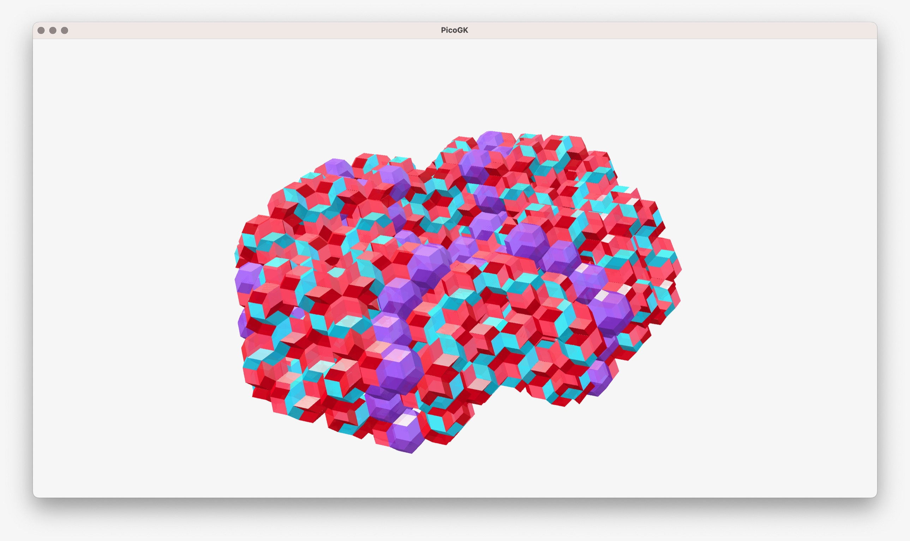
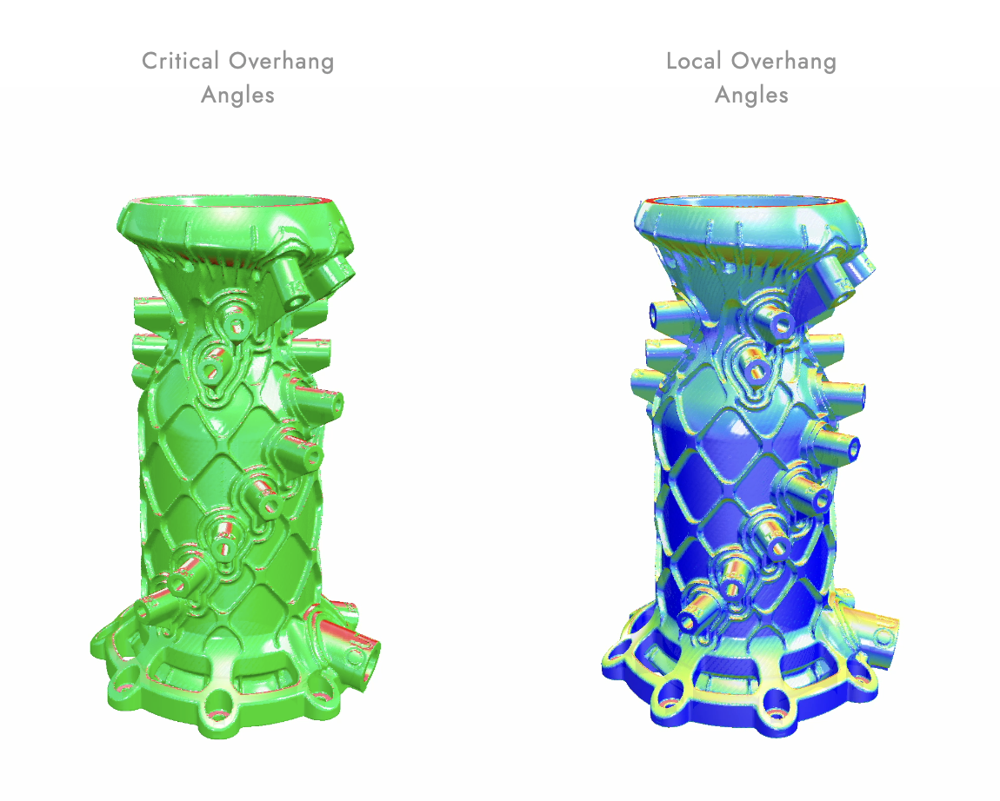

**[PicoGK.org](https://picogk.org)/Labs**

# Welcome to PicoGK Labs

On these pages we are showing some of the work in progress projects we are working on at [LEAP 71](https://leap71.com).

All of our work is based on PicoGK ("peacock"), [our open-source Computational Engineering framework](https://github.com/leap71/PicoGK). 

Much of the code shown in the Lab Notes below is available [on our Github](https://github.com/leap71).

## Lab Notes

### An open-source library for generating Penrose Tiles and Quasicrystals on PicoGK

**2024-04-08 / by Josefine Lissner**

I am currently reading Paul J. Steinhardt's book "The Second Kind of Impossible" about the multi-decade long journey of predicting, understanding and discovering [quasicrystals](https://en.wikipedia.org/wiki/Quasicrystal). If you are familiar with the 2D aperiodic [Penrose tiling](https://en.wikipedia.org/wiki/Penrose_tiling), you might recognize quasi-crystals as the 3D version. Quasicrystals have novel properties and have been the focus of much materials research.

It got me wondering why these kind of patterns are not commonly used in engineering. But from diving into the construction logic of these strange, non-repeating patterns, it becomes clear, that it is impossible to sketch them out manually in CAD - the only way to use them, is through a computational approach.

At LEAP 71 we think, that aperiodic tilings and quasi-crystalline structures could be suitable for applications like hypersonics, because they likely have interesting properties in terms of vibration propagation.

So, in order to make quasicrystals more accessible and get people excited about them, I have just published another open-source library based on PicoGK that holds computational descriptions of the elementary quasi-tiles (described in the book and literature) and commonly used inflation/sub-division rules to "grow" new and more complex generations quasicrystals.

Check out the new library [on our Github here.](https://github.com/leap71/LEAP71_QuasiCrystals)

------

### Experimenting with LLMs and Computational Engineering

**2024-03-31 / by Lin Kayser**

For the past week I have been trying to put to the test, some of the hypotheses I layed out in my article [Computational Engineering today, AI Engineering tomorrow, and when do we get J.A.R.V.I.S.?](https://jlk.ae/2023/03/29/computational-engineering-today-ai-engineering-tomorrow-and-when-do-we-get-j-a-r-v-i-s/) I published excactly a year ago and which I followed up in January with [On Tribal Knowledge, LLMs and Computational Knowledge in Engineering](https://jlk.ae/2024/01/01/on-tribal-knowledge-llms-and-computational-knowledge-in-engineering/).

In the article I describe how attempts to "somehow" train an AI to directly generate functional physical objects are likely futile. Showing a neural net tens of thousands of jet engines (even if you had access to detailed schematics), and then thinking it would invent a new one is wishful thinking. Engineering is based on physics, math, logic, hard computational knowledge. The "soft" world of machine intuition is simply not a good fit. You need a Computational Engineering Model based on ironclad scientific rules. Translating engineering knowledge to computer code is what we do at LEAP 71, so we are building the models in the fields we are working in. Now, the question is, if you have a Computational Model that creates a physical object (like we do), can you train on LLM on this code, and create a conversational interface to engineering? Essentially, can you create J.A.R.V.I.S. from Iron Man? 

From my initial tests, I can say, absolutely, but ... it's going to require effort!

In my experiments, which were as basic as you can imagine, I used OpenAI's public API to automatically send prompts to, essentially, ChatGPT, which include a code example, to give it context and then ask the LLM to invent something new, based on my natural language description. My app then automatically extracted the code the LLM gave me, ran it through the [Roslyn framework](https://en.wikipedia.org/wiki/Roslyn_(compiler)) which allows us to compile code from within a C# application. If errors were reported, the app flags them and automatically ask ChatGPT to fix them, until we get something that compiles. Now OpenAI's context window is not large enough to send the entire PicoGK source code, and megabytes of examples, let alone a comprehensive Computational Engineering Model, so a lot of it is hit or miss. But you can see where this could go, if you had a dedicated model trained on a large Computational Engineering code base. 

[Check out the experiments over here.](2024-03-31-Lin/README.md#setup)

------

### Experimenting with LLMs and Computational Engineering

**2024-03-21 / by Josefine Lissner**

A few months ago, we released PicoGK and we have been improving it ever since! Here is one of the more visually attractive updates: a MeshPainter function that allows you to color a 3D object according to a custom distribution (e.g. overhang angles, wall thicknesses or any other field). 

To get access, make sure you update the [ShapeKernel to the latest version on GitHub](https://github.com/leap71/LEAP71_ShapeKernel).

Here is the [example](https://github.com/leap71/PicoGK/discussions/22).

------

*© 2024 by LEAP 71 — All Rights Reserved*
